# 1- Closing the Gap: Detecting, Fixing, and Verifying the IDOR

## Recap

The [previous phase](./3-Baseline%20Testing.md) established that ModSecurity, no matter how well configured, cannot meaningfully block IDOR or brute-force attempts — they're logic-layer flaws, not payload-shaped attacks, and application-level logging (`meridian_security.log` → Splunk index `web_app_security`) was added to give visibility where the WAF has none. This phase closes the loop: build a real Splunk detection for the IDOR, confirm it catches the abuse, fix the underlying flaw in the application, and verify the fix actually holds.

## Step 1: Detecting IDOR Abuse in Splunk

The signal for IDOR abuse isn't a single request — a legitimate HR manager looking up one employee record is completely normal. The signal is a low-privilege user accessing an unusual number of *distinct* employee records in a short window, which looks nothing like normal self-service use and a lot like enumeration.

```
index=web_app_security earliest=-15m "event=employee_record_access"
| rex field=_raw "src_ip=(?<src_ip>[\d.]+)"
| rex field=_raw "viewer_user=\"(?<viewer_user>[^\"]+)\""
| rex field=_raw "viewer_role=\"(?<viewer_role>[^\"]+)\""
| rex field=_raw "target_employee_id=(?<target_id>\d+)"
| where viewer_role != "admin" AND viewer_role != "hr"
| stats dc(target_id) as distinct_records_viewed, values(target_id) as ids_viewed,
        values(src_ip) as src_ip, earliest(_time) as first_seen, latest(_time) as last_seen
        by viewer_user, viewer_role
| where distinct_records_viewed >= 3
| convert ctime(first_seen) ctime(last_seen)
```

The first pass at this query returned nothing, which turned out to be a threshold problem rather than a logic problem: the test traffic had only hit 2 distinct employee IDs, one of them twice, and the filter required at least 3 distinct IDs. After probing a few more employee IDs as the `analyst` user (role `employee`, not `admin`/`hr`), the query correctly surfaced the pattern:

| viewer_user | viewer_role | distinct_records_viewed | ids_viewed | src_ip |
|---|---|---|---|---|
| analyst | employee | 4 | 10, 14, 7, 99 | 10.248.52.192 |

This confirms the detection logic works: a non-privileged user viewing 4 distinct employee records — including ones with no legitimate relationship to their role — inside a 15-minute window is exactly the enumeration behavior this query is meant to catch. This was saved as a scheduled Splunk alert (`*/5 * * * *`, triggering on Number of Results > 0).

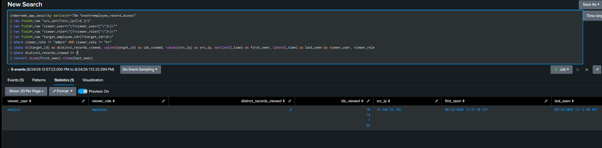

## Step 2: Manual Confirmation of the Underlying Flaw

Detection alone doesn't prove the vulnerability is real — it proves the *pattern* is real. To confirm the actual data exposure, a direct `curl` reproduction was run as `analyst`:

```bash
curl -c cookies.txt -X POST http://<target>:8888/login -d "username=analyst&password=analyst!1"
curl -b cookies.txt http://<target>:8888/employees/10
```

The response returned full employee detail — name, department, email, salary, and a fake internal reference number — for an employee with no relationship to the `analyst` account. Confirmed: any authenticated user, regardless of role, could view any other employee's full record by changing the ID in the URL.

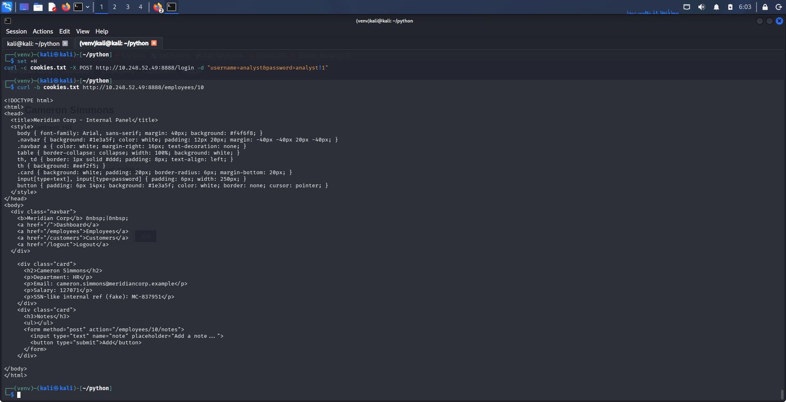

## Step 3: The Fix

The root cause was that `/employees/<id>` never checked whether the requesting user's role permitted viewing that specific record — it only checked that *some* user was logged in. The fix adds a role check before the record is fetched:

```python
allowed_roles = {"admin", "hr"}
if session.get("role") not in allowed_roles:
    auth_logger.info(
        f'event=access_denied reason="idor_attempt" viewer_user="{session.get("user")}" '
        f'viewer_role="{session.get("role")}" target_employee_id={emp_id} src_ip={client_ip()}'
    )
    return render("<div class='card'><p>403 - You do not have permission to view this record.</p></div>"), 403
```

Two things worth noting about this fix:

- It's intentionally coarse — `employee`-role users are blocked from *all* individual record views rather than being scoped to "their own record only," because there's no existing mapping between login accounts and employee records in this lab's schema. A production fix would more likely scope access to the user's own record (or their reporting chain), not block the endpoint outright. The point here is closing the unauthorized-access gap, not building a complete authorization model.
- The denied attempt is logged as a distinct event (`event=access_denied reason="idor_attempt"`) rather than just returning a 403 silently. This means post-fix, the same abuse pattern that used to be invisible to the WAF is now visible twice over: once as a successful detection (pre-fix) and once as a logged, blocked attempt (post-fix) — useful for confirming an attacker is still probing even after the door is closed.

## Step 4: Verifying the Fix

Same reproduction, after the fix:

```bash
curl -b cookies.txt http://<target>:8888/employees/10
```

```
403 - You do not have permission to view this record.
```

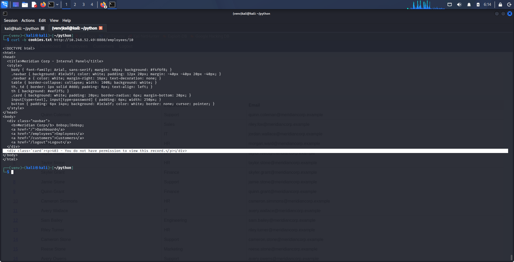

And in Splunk, the denied attempts are now visible under the new event type:

```
index=web_app_security earliest=-15m "event=access_denied" "reason=\"idor_attempt\""
| rex field=_raw "viewer_user=\"(?<viewer_user>[^\"]+)\""
| rex field=_raw "target_employee_id=(?<target_id>\d+)"
| rex field=_raw "src_ip=(?<src_ip>[\d.]+)"
| stats count as denied_attempts, values(target_id) as attempted_ids by viewer_user, src_ip
```

| viewer_user | src_ip | denied_attempts | attempted_ids |
|---|---|---|---|
| analyst | 10.248.52.192 | 3 | 10, 3, 6 |


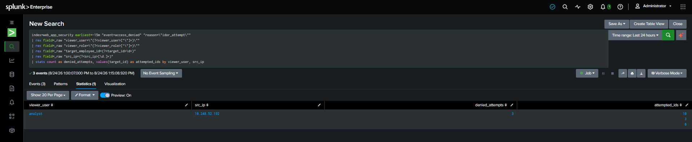

Finally, to confirm the fix didn't break legitimate access, the same request was repeated as `admin`:

```bash
curl -b admin_cookies.txt http://<target>:8888/employees/10
```

This returned the full employee record as expected — the fix blocks unauthorized roles without affecting the roles that should have access.

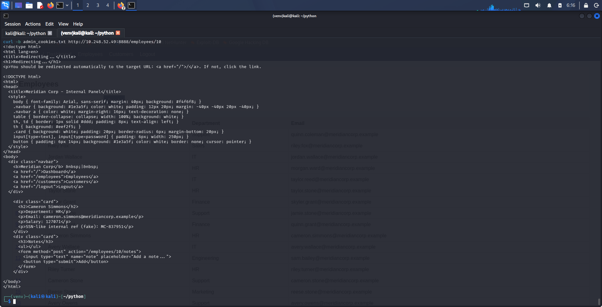

## Takeaways

- Detection thresholds need real traffic to validate, not just logical review — the first version of the query was correct but returned nothing until the test data actually crossed the threshold, which is worth remembering before assuming a "silent" detection is broken.
- A Splunk detection proves a *pattern* occurred; it doesn't by itself prove data was exposed. Pairing the alert with a manual reproduction (or, in a real environment, log evidence of response content) is what turns "someone accessed 4 records" into a confirmed finding.
- Fixing an access-control flaw and having a detection for its abuse aren't redundant — the detection stays useful after the fix as a way to see whether anyone is still probing for the (now closed) hole, which is exactly what the `access_denied` event captures.
- Verifying a fix means checking both directions: that the attack path is now blocked, and that legitimate use of the same endpoint still works.

---

# 2- The Fix That Wasn't: Bypassing Access Control via Session Forgery

## Recap

The previous phase closed the IDOR on `/employees/<id>` with a role check: only `admin` and `hr` roles could view individual employee records, verified with both a manual `curl` reproduction and a Splunk detection for denied attempts. That fix held up under every test run against it — as the `analyst` user. This phase asks a different question: was the fix actually sound, or did it just look sound against the one attack path that had been tried so far?

## Widening the Test Surface

Before accepting the IDOR fix as complete, three additional angles needed checking that hadn't been touched yet:

1. **Write-path IDOR** — `POST /employees/<id>/notes` was never given the same role check as the read path. Any authenticated user can still attach a note to any employee's record regardless of role.
2. **The JSON API** — `/api/employees` only checks that *someone* is logged in, with no role restriction, mirroring the same gap the read endpoint had before it was fixed.
3. **Session integrity** — this is the one that mattered most.

## Finding: A Forgeable Session Is a Broken Access Control, Full Stop

Manually editing the session cookie's payload in Burp Suite (decoding the JWT-like structure, changing `"role":"employee"` to `"role":"admin"`) predictably failed — Flask rejected it and redirected to `/login`. Flask session cookies aren't encrypted, only signed: the payload is plainly base64-decodable, but a tampering attempt without also recomputing a valid signature gets the whole session discarded.

The signature, however, is computed with `itsdangerous` using the application's `secret_key` — and in `app.py`, that key was a hardcoded string: `app.secret_key = "lab-only-not-a-real-secret"`. Since this is a real value sitting in source code (source code that was about to be pushed to a public repository as part of this lab), it isn't secret at all. Anyone who can read it can produce validly signed sessions for any role, for a username that has never logged in, without ever knowing a password:

```python
from flask.sessions import SecureCookieSessionInterface
from flask import Flask

app = Flask(__name__)
app.secret_key = "lab-only-not-a-real-secret"  

serializer = SecureCookieSessionInterface().get_signing_serializer(app)
forged_cookie = serializer.dumps({"user": "attacker", "role": "admin"})
```

Dropping the resulting cookie into a request —

```bash
curl -b "session=<forged_cookie>" http://<target>:8888/employees/10
```

— returned the full employee record, including salary and internal reference number, as a completely fabricated `admin` user that had never authenticated. **The role-based access control fix from the previous phase was fully bypassed**, because that fix checks `session['role']`, and the session itself was never trustworthy to begin with.

This is the important lesson of the phase: the previous fix wasn't wrong, exactly — it correctly restricts the *endpoint* by role. But it implicitly assumes the session it's reading is authentic. An access-control check is only as strong as the integrity of the identity data it relies on. Fixing authorization logic on top of a forgeable identity layer is fixing the wrong end of the problem.

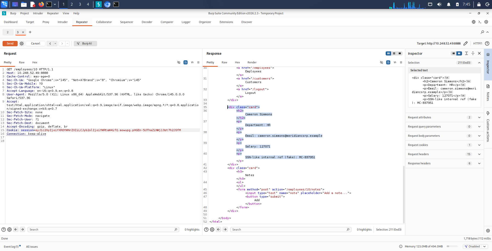

## Fix

```python
import os
app.secret_key = os.environ.get("FLASK_SECRET_KEY") or os.urandom(32)
```

The key is now either supplied externally (the correct production pattern — a strong, randomly generated value set via environment variable or secrets manager, never committed to source control) or generated fresh at process startup. Either way, it's no longer a static, publicly-readable value, so a signature computed against it can't be reproduced without access to the running process.

## Verification

The exact same forged cookie from before, replayed against the app after the fix:

```
HTTP/1.1 302 FOUND
Location: /login
```

The session is rejected outright — Flask can no longer validate a signature produced against a key it no longer uses (and a newly-generated key can't be predicted or reproduced by an attacker who only has the source code). The forged `admin` session is dead on arrival.

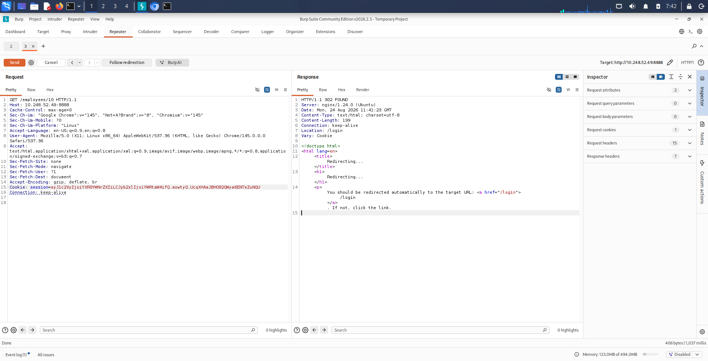

## Takeaways

- Access control is only as strong as the identity it trusts. A correct role check on top of a forgeable session is not a real fix — it's a fix for the wrong layer. This is worth checking *before* declaring an authorization fix complete, not after.
- Hardcoded secrets are a distinct, and arguably more severe, class of finding than the access-control bug they end up enabling — the secret key wasn't just a weak credential, it was about to be published verbatim in the project's own public source code, which is exactly how this class of bug tends to surface in the real world (a secret committed to a public repo, later found by anyone reading the code — this project's own repo was about to be a live example if this hadn't been caught).
- Widening the test surface after a fix — rather than only re-testing the exact path that was already proven vulnerable — is what surfaced this. The original fix passed every test that had been run against it; it failed the one that hadn't been tried yet.


---

# 3- Write Access Was Never Checked Either

## Recap

Fixing the read-path IDOR on `/employees/<id>` and then finding that fix was fully bypassable via session forgery raised an obvious question: what else got missed the first time around? Widening the test surface turned up two more gaps — this phase covers the first one, a write-path IDOR on the notes endpoint that the original fix never touched.

## Finding

The role check added to `employee_detail()` (`GET /employees/<id>`) was never mirrored on `add_note()` (`POST /employees/<id>/notes`). Using Burp Suite Repeater with a valid `analyst` session (role: `employee`):

```
POST /employees/10/notes HTTP/1.1
Host: 10.248.52.49:8888
Cookie: session=<analyst session>
Content-Type: application/x-www-form-urlencoded

note=idor-test-by-analyst
```

Response:
```
HTTP/1.1 302 FOUND
Location: /employees/10
```

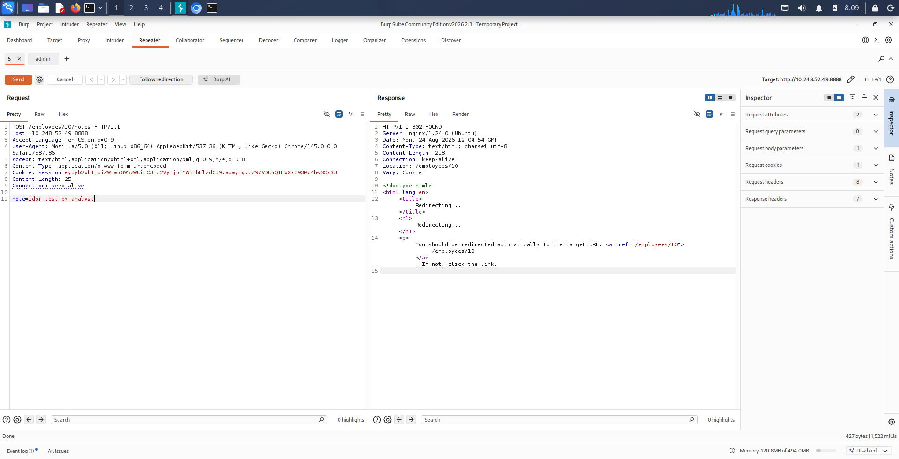

The note was accepted and written to employee ID 10's record — an employee `analyst` has no relationship to and, after the read-path fix, can't even view anymore. Confirmed independently: replaying `GET /employees/10` with an `admin` session showed the injected note (`idor-test-by-analyst`) sitting in that employee's Notes section.

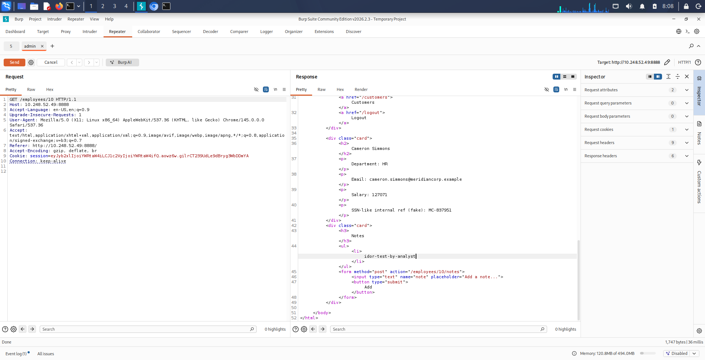


The asymmetry is worth noting explicitly: this is a case where `analyst` could write data into a record it's no longer permitted to *read*. That's a stranger and arguably worse state than the original unrestricted-read IDOR — a low-privilege account blindly injecting content into records it can't see, with no way to know what it actually wrote where.

## Why This One Matters More Than It Looks

This finding compounds with an existing vulnerability rather than standing alone: the same notes field is a documented stored-XSS sink (`employee_notes.note` is rendered without escaping in `employee_detail()`). On its own, a write-path IDOR would just mean unauthorized note-spam. Combined with the XSS sink, it changes who the payload can reach.

Without the write-path IDOR, a stored-XSS payload from a low-privilege account could only ever land on that account's own accessible records — a limited blast radius. With the write-path IDOR, the same low-privilege account can plant a payload directly on records that `admin` or `hr` users are known to check routinely. The vulnerability class doesn't change, but the reachable set of victims does — from "yourself" to "whoever has legitimate reason to open this record," which in this app is exactly the higher-privileged roles that would matter most to compromise.

(ModSecurity currently blocks the specific XSS payloads tested against this app, so this isn't an active end-to-end chain right now — but it's a reminder that authorization gaps don't need to be evaluated purely on their own; who a gap hands a payload to matters as much as the gap itself.)

## Fix

The same role check pattern from the read-path fix, applied to `add_note()`:

```python
@app.route("/employees/<emp_id>/notes", methods=["POST"])
def add_note(emp_id):
    if not require_login():
        return redirect(url_for("login"))

    allowed_roles = {"admin", "hr"}
    if session.get("role") not in allowed_roles:
        auth_logger.info(
            f'event=access_denied reason="idor_write_attempt" viewer_user="{session.get("user")}" '
            f'viewer_role="{session.get("role")}" target_employee_id={emp_id} src_ip={client_ip()}'
        )
        return render("<div class='card'><p>403 - You do not have permission to modify this record.</p></div>"), 403

    note = request.form.get("note", "")
    # ... unchanged insert logic
```

The denial is logged with a distinct `reason="idor_write_attempt"` (versus the read path's `idor_attempt`), so Splunk can tell a blocked read attempt from a blocked write attempt rather than collapsing both into one signal — worth keeping separate since an attacker probing for read access and one actively trying to plant content are different levels of concern.

## Verification

Same Burp Suite request, replayed after the fix, as `analyst`:

```
HTTP/1.1 403 FORBIDDEN
```

And confirmed the note was **not** written — re-checking employee 10's record as `admin` showed no new entry. The fix blocks the request before it reaches the database, not just at render time.

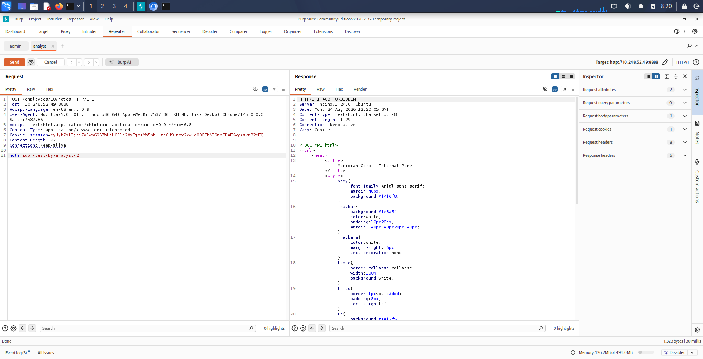

## Takeaways

- A fix scoped to "the endpoint where I found the bug" instead of "every endpoint touching this resource" leaves siblings of the same flaw in place. Read and write access to the same resource need the same authorization check independently — fixing one doesn't imply the other got fixed too.
- Authorization gaps should be evaluated in combination with what else they touch, not just in isolation. A write-path IDOR that looks like a minor annoyance on its own becomes a much more serious finding once you notice it removes the natural containment on a nearby XSS sink.
- Splunk logging for authorization denials benefits from distinguishing *what kind* of unauthorized action was attempted (read vs. write), not just that one occurred — the response and priority to a blocked write attempt should arguably differ from a blocked read attempt.


---

# 4- Not Every Finding Is an IDOR: The API Endpoint That Made IDOR Easier

## Recap

With the read-path IDOR, write-path IDOR, and the session-forgery bypass all fixed and detected, the last unrestricted employee-data endpoint was `/api/employees` — a JSON API returning the full employee directory (ID, name, department) to any authenticated user. Testing it, though, surfaced a useful distinction worth being precise about: this isn't an IDOR.

## Why This Isn't an IDOR — and Why That Distinction Matters

IDOR means accessing a specific resource you're not authorized for by manipulating an identifier. `/api/employees` doesn't take an ID at all — it returns the entire directory in one response, to anyone who asks. Calling it an IDOR would misdiagnose the vulnerability class, and a misdiagnosed finding gets the wrong fix. The actual category here is **broad, unauthorized information disclosure** — closer to an excessive-data-exposure / missing-access-control finding than an object-reference flaw.

The distinction matters because the two failure modes call for different reasoning about impact, even when the fix (a role check) ends up looking similar. That reasoning here breaks down into two separate points:

**1. Reconnaissance value.** A single unauthenticated-by-role `GET` returns the full org chart in one JSON payload — every name paired with its department. An attacker can filter that instantly for, say, everyone in HR or IT and have a pre-qualified spear-phishing target list without sending a single additional request. Compare that to the alternative: scraping the same information one guess at a time through `/employees/search?q=a`, `q=b`, etc. — far noisier, far slower, and far more visible in logs.

**2. It quietly enables the IDOR it doesn't itself commit.** The read-path IDOR on `/employees/<id>` is now fixed, but that fix doesn't stop someone from *trying* IDs — it just means each attempt gets logged and blocked. An attacker fuzzing IDs 1 through 1000 against that endpoint generates exactly the kind of repetitive, sequential access pattern this lab's own detection query was built to catch. `/api/employees`, before this fix, let an attacker skip that step entirely: pull the full list of valid IDs silently, then target only real ones — no fuzzing noise, nothing to trip the enumeration detection built in an earlier phase. The endpoint doesn't perform IDOR itself, but it removes the exact behavioral signal that would otherwise flag someone trying to.

This is the same theme as the write-path IDOR's relationship to the stored-XSS sink: findings interact, and a "lower-severity" issue can materially change how effective or how detectable a more serious one becomes. Evaluating a finding purely in isolation — "it only leaks name and department" — misses what it enables.

## Fix

Consistent with the rest of the employee-data endpoints, access is restricted to `admin`/`hr` roles. Two logging additions came with it, deliberately treated as distinct event types:

```python
allowed_roles = {"admin", "hr"}
if session.get("role") not in allowed_roles:
    auth_logger.info(
        f'event=access_denied reason="api_directory_scrape_attempt" ...'
    )
    return jsonify({"error": "forbidden"}), 403
...
auth_logger.info(
    f'event=api_directory_access viewer_user="{session.get("user")}" '
    f'viewer_role="{session.get("role")}" record_count={len(rows)} src_ip={client_ip()}'
)
```

The denial reason (`api_directory_scrape_attempt`) is named for what it actually represents — an attempt to pull the whole directory at once — distinct from the `idor_attempt` / `idor_write_attempt` reasons used elsewhere, so Splunk queries can tell these apart. Successful, authorized pulls are also logged now (`api_directory_access`), including the record count returned — not because admin/hr access is a problem, but so that unusually frequent full-directory pulls (a compromised admin account being used for scraping, for instance) have a baseline to be compared against later.

## Verification

As `analyst` (role `employee`), post-fix:

```bash
curl -b cookies.txt http://<target>:8888/api/employees
```
```json
{"error":"forbidden"}
```

As `admin`, the same request still returns the full 40-record directory — the fix didn't affect legitimate access. Both outcomes confirmed in Splunk:

```
event=access_denied reason="api_directory_scrape_attempt" viewer_user="analyst" viewer_role="employee" src_ip=10.248.52.192
event=api_directory_access viewer_user="admin" viewer_role="admin" record_count=40 src_ip=10.248.52.192
```

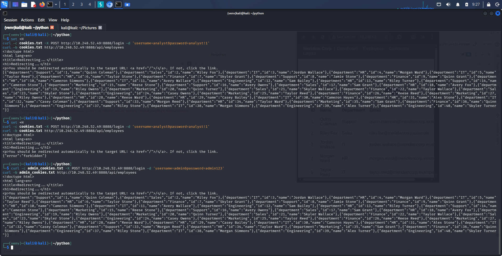

## Takeaways

- Not every access-control gap is the same vulnerability class, even when they sit in the same application and get similar-looking fixes. Naming a finding correctly (information disclosure vs. IDOR vs. authentication bypass) isn't pedantry — it changes what you check for impact and what a correct fix actually needs to do.
- A finding's severity isn't just what it directly exposes — it's also what it enables or conceals for other findings nearby. This endpoint's real cost wasn't the name/department leak; it was removing the noisy fuzzing pattern that would otherwise have made an ID-enumeration attack visible.
- Logging both the denied and the authorized path (not just failures) sets up detection for a different kind of problem later: not "who got blocked," but "is a legitimate, authorized account behaving like it's being used for bulk scraping."

## Where the lab stands now

All four employee-data endpoints (`/employees/<id>` read, `/employees/<id>/notes` write, `/api/employees`, and session integrity itself) are now access-controlled and have corresponding Splunk detections. Remaining open item: `/login` still has no rate limiting or lockout against brute force, though the detection for repeated failures is already built and alerting.