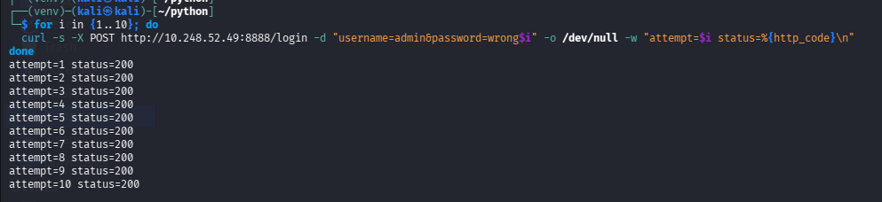
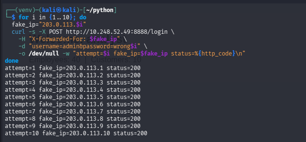
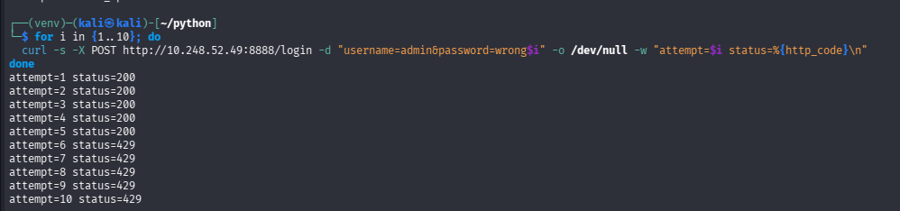
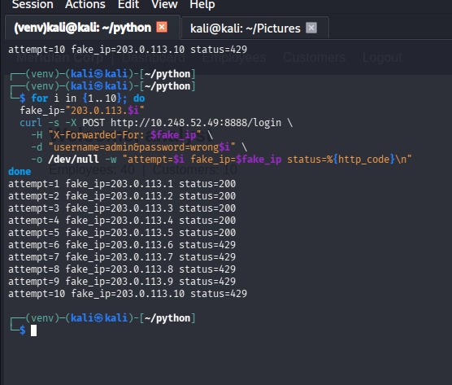

# 1- Brute Force: Single Source, Single Account → Rotating Sources, Single Account

## Recap

The [baseline testing phase](./3-Baseline%20Testing.md) established that `/login` had zero rate limiting — 10 unthrottled attempts all reached the app. That finding sat unfixed while the IDOR chain was worked through. This phase tackles it properly, testing progressively harder attack shapes before writing any fix, rather than patching the first thing observed and assuming it covers everything.

## Stage 1: Single Source IP, Single Account

```bash
for i in {1..10}; do
  curl -s -X POST http://<target>:8888/login -d "username=admin&password=wrong$i" \
    -o /dev/null -w "attempt=$i status=%{http_code}\n"
done
```



All 10 attempts returned `200` — the app evaluated the password check every single time, with nothing tracking how many times this had already failed. Confirmed in Splunk: 10 `login_failure` events, same `src_ip`, same `user`.

This is the simplest possible fix target: a per-IP counter that locks out after N failures in a window.

## Stage 2: Rotating Source IPs, Same Account

Before writing that fix, the same attack was retried with each attempt spoofing a different `X-Forwarded-For` value:

```bash
for i in {1..10}; do
  curl -s -X POST http://<target>:8888/login \
    -H "X-Forwarded-For: 203.0.113.$i" \
    -d "username=admin&password=wrong$i" \
    -o /dev/null -w "attempt=$i fake_ip=203.0.113.$i status=%{http_code}\n"
done
```




Also 10/10 successful reaches of the password check. This wasn't just "the app still has no rate limiting" — it demonstrated that a naive per-IP-only fix would have been defeated trivially. If Stage 1's fix had shipped alone (lock out an IP after N failures), an attacker only needed to rotate the source IP each request to reset the counter every time, and this app already trusts the client-supplied `X-Forwarded-For` header without any validation that it came from a legitimate reverse-proxy hop — meaning the attacker doesn't even need real distributed infrastructure, just a header value they made up.

Testing this before writing a fix — rather than fixing Stage 1 and assuming it was sufficient — is what surfaced that gap.

## A Detour: Why Doesn't the WAF Catch This?

Worth answering directly, because it comes up naturally at this point: ModSecurity has been blocking SQLi and XSS reliably throughout this lab, so why does 10 (or 20) failed logins sail through untouched?

Because a login attempt with a wrong password is, structurally, a completely normal request. `POST /login` with `username=admin&password=wrong5` has no injection pattern, no malformed protocol element, nothing that resembles an attack signature — it's indistinguishable from a real user who fat-fingered their password. WAF rules match request *shape*; brute force is a *behavioral* pattern across multiple requests, and worse, it depends on information the WAF fundamentally doesn't have access to: whether the password was actually correct. Only the application knows that.

This is the same blind spot documented in an earlier phase for IDOR — the WAF is not redundant with application-level controls, it protects a different layer entirely. The two aren't competing solutions to the same problem; a signature-based perimeter and application-level logic/identity controls are complementary layers, and neither substitutes for the other. (A WAF or reverse proxy *can* contribute basic connection-rate limiting as a coarser, defense-in-depth layer — but the actual "is this attacker still guessing at this specific account" logic has to live where the password check happens.)

## Fix

A single mechanism that tracks failures by two independent keys — source IP and username — with either one crossing the threshold triggering a lockout:

```python
MAX_FAILURES = 5
WINDOW_SECONDS = 300      # 5 minutes
LOCKOUT_SECONDS = 900     # 15 minutes
_failures = {}       # "ip:<ip>" or "user:<username>" -> failure timestamps
_locked_until = {}   # same keys -> unix timestamp when lockout ends
```

On each failed login, both the requesting IP's counter and the attempted username's counter are incremented. A lockout on *either* key blocks further attempts against that IP or that username — checked before the password comparison even runs, so a locked-out attempt never touches the database:

```python
if is_locked_out(ip, username):
    auth_logger.info(f'event=login_blocked reason="rate_limited" ...')
    return render(...), 429
```

This directly answers both stages tested: Stage 1's repeated failures from one IP trip the per-IP key; Stage 2's rotating-IP attempts against one account still accumulate against the per-username key, since the username doesn't change even when the IP does. A successful login clears both counters for that IP/username pair, so a legitimate user who mistypes their password a couple of times isn't penalized once they get it right.

Three distinct log events came out of this, each meaningfully different:
- `login_failure` — one failed attempt (already existed)
- `account_locked` — the exact attempt that crossed a threshold, tagged with `reason="ip_threshold"` or `reason="username_threshold"` so Splunk can tell which key triggered it
- `login_blocked reason="rate_limited"` — a request that arrived *after* lockout was already active (useful for seeing whether an attacker backs off or keeps hammering a dead lock)

## Verification

Stage 1, replayed post-fix:
```
attempt=1..5  status=200   (still reach the password check, still fail normally)
attempt=6..10 status=429   (locked out — rejected before the password check)
```

Stage 2, replayed post-fix (10 different spoofed IPs, same account):
```
attempt=1..5  status=200
attempt=6..10 status=429
```

Identical shape in both cases — exactly what the per-username key is supposed to guarantee: rotating the IP no longer resets anything, because the lockout that matters here is keyed on the account being targeted, not the (trivially spoofable) source.





## Takeaways

- Testing the "obvious" attack shape and fixing only that is how defenses that look complete get quietly defeated by the next variation. Stage 2 existed specifically to check whether the natural first fix (IP-only) would hold — and it wouldn't have.
- A client-supplied header (`X-Forwarded-For`) that the app trusts without validating its origin isn't just an implementation detail — it's what made Stage 2 possible without any real distributed infrastructure on the attacker's side. Worth remembering as a standalone caveat even outside the brute-force context.
- WAF and application-layer defenses aren't redundant, and "we already have a WAF" is not a reason to skip building account-level protections. Signature-based tools protect against payload-shaped attacks; behavioral/logic-shaped attacks like brute force need to be handled where the relevant state (attempt history, credential correctness) actually lives.


---

