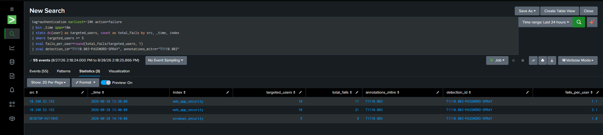

# 1- Brute Force: Single Source, Single Account → Rotating Sources, Single Account

## Recap

The [baseline testing phase](./3-Baseline%20Testing.md) established that `/login` had zero rate limiting — 10 unthrottled attempts all reached the app. That finding sat unfixed while the IDOR chain was worked through. This phase tackles it properly, testing progressively harder attack shapes before writing any fix, rather than patching the first thing observed and assuming it covers everything.

## Stage 1: Single Source IP, Single Account

```bash
for i in {1..10}; do
  curl -s -X POST http://<target>:8888/login -d "username=admin&password=wrong$i" \
    -o /dev/null -w "attempt=$i status=%{http_code}\n"
done
```


All 10 attempts returned `200` — the app evaluated the password check every single time, with nothing tracking how many times this had already failed. Confirmed in Splunk: 10 `login_failure` events, same `src_ip`, same `user`.

This is the simplest possible fix target: a per-IP counter that locks out after N failures in a window.

## Stage 2: Rotating Source IPs, Same Account

Before writing that fix, the same attack was retried with each attempt spoofing a different `X-Forwarded-For` value:

```bash
for i in {1..10}; do
  curl -s -X POST http://<target>:8888/login \
    -H "X-Forwarded-For: 203.0.113.$i" \
    -d "username=admin&password=wrong$i" \
    -o /dev/null -w "attempt=$i fake_ip=203.0.113.$i status=%{http_code}\n"
done
```


Also 10/10 successful reaches of the password check. This wasn't just "the app still has no rate limiting" — it demonstrated that a naive per-IP-only fix would have been defeated trivially. If Stage 1's fix had shipped alone (lock out an IP after N failures), an attacker only needed to rotate the source IP each request to reset the counter every time, and this app already trusts the client-supplied `X-Forwarded-For` header without any validation that it came from a legitimate reverse-proxy hop — meaning the attacker doesn't even need real distributed infrastructure, just a header value they made up.

Testing this before writing a fix — rather than fixing Stage 1 and assuming it was sufficient — is what surfaced that gap.

## A Detour: Why Doesn't the WAF Catch This?

Worth answering directly, because it comes up naturally at this point: ModSecurity has been blocking SQLi and XSS reliably throughout this lab, so why does 10 (or 20) failed logins sail through untouched?

Because a login attempt with a wrong password is, structurally, a completely normal request. `POST /login` with `username=admin&password=wrong5` has no injection pattern, no malformed protocol element, nothing that resembles an attack signature — it's indistinguishable from a real user who fat-fingered their password. WAF rules match request *shape*; brute force is a *behavioral* pattern across multiple requests, and worse, it depends on information the WAF fundamentally doesn't have access to: whether the password was actually correct. Only the application knows that.

This is the same blind spot documented in an earlier phase for IDOR — the WAF is not redundant with application-level controls, it protects a different layer entirely. The two aren't competing solutions to the same problem; a signature-based perimeter and application-level logic/identity controls are complementary layers, and neither substitutes for the other. (A WAF or reverse proxy *can* contribute basic connection-rate limiting as a coarser, defense-in-depth layer — but the actual "is this attacker still guessing at this specific account" logic has to live where the password check happens.)

## Fix

A single mechanism that tracks failures by two independent keys — source IP and username — with either one crossing the threshold triggering a lockout:

```python
MAX_FAILURES = 5
WINDOW_SECONDS = 300      # 5 minutes
LOCKOUT_SECONDS = 900     # 15 minutes
_failures = {}       # "ip:<ip>" or "user:<username>" -> failure timestamps
_locked_until = {}   # same keys -> unix timestamp when lockout ends
```

On each failed login, both the requesting IP's counter and the attempted username's counter are incremented. A lockout on *either* key blocks further attempts against that IP or that username — checked before the password comparison even runs, so a locked-out attempt never touches the database:

```python
if is_locked_out(ip, username):
    auth_logger.info(f'event=login_blocked reason="rate_limited" ...')
    return render(...), 429
```

This directly answers both stages tested: Stage 1's repeated failures from one IP trip the per-IP key; Stage 2's rotating-IP attempts against one account still accumulate against the per-username key, since the username doesn't change even when the IP does. A successful login clears both counters for that IP/username pair, so a legitimate user who mistypes their password a couple of times isn't penalized once they get it right.

Three distinct log events came out of this, each meaningfully different:
- `login_failure` — one failed attempt (already existed)
- `account_locked` — the exact attempt that crossed a threshold, tagged with `reason="ip_threshold"` or `reason="username_threshold"` so Splunk can tell which key triggered it
- `login_blocked reason="rate_limited"` — a request that arrived *after* lockout was already active (useful for seeing whether an attacker backs off or keeps hammering a dead lock)

## Verification

Stage 1, replayed post-fix:
```
attempt=1..5  status=200   (still reach the password check, still fail normally)
attempt=6..10 status=429   (locked out — rejected before the password check)
```

Stage 2, replayed post-fix (10 different spoofed IPs, same account):
```
attempt=1..5  status=200
attempt=6..10 status=429
```

Identical shape in both cases — exactly what the per-username key is supposed to guarantee: rotating the IP no longer resets anything, because the lockout that matters here is keyed on the account being targeted, not the (trivially spoofable) source.


## Takeaways

- Testing the "obvious" attack shape and fixing only that is how defenses that look complete get quietly defeated by the next variation. Stage 2 existed specifically to check whether the natural first fix (IP-only) would hold — and it wouldn't have.
- A client-supplied header (`X-Forwarded-For`) that the app trusts without validating its origin isn't just an implementation detail — it's what made Stage 2 possible without any real distributed infrastructure on the attacker's side. Worth remembering as a standalone caveat even outside the brute-force context.
- WAF and application-layer defenses aren't redundant, and "we already have a WAF" is not a reason to skip building account-level protections. Signature-based tools protect against payload-shaped attacks; behavioral/logic-shaped attacks like brute force need to be handled where the relevant state (attempt history, credential correctness) actually lives.


---

# 2- Brute Force: Stage 3-4: Credential Spraying and the Limits of Trusting a Header

## Recap

Stage 1 and 2; fixed single-account brute force by tracking failures against both the source IP and the targeted username, and confirmed it held up against a single account being hit from rotating spoofed IPs. This phase inverts the attack shape — spraying one password across many accounts — and then combines it with IP rotation, which is where the app-level fix from the previous phase runs out of road.

## Stage 3: Single IP, Many Accounts (Password Spraying)

```bash
usernames=(admin hr_manager analyst root test info support sales hr it)
for u in "${usernames[@]}"; do
  curl -s -X POST http://<target>:8888/login -d "username=$u&password=Password123" \
    -o /dev/null -w "user=$u status=%{http_code}\n"
done
```

Result: the first 5 attempts returned `200`, the remaining 5 returned `429`. At first glance this looks like the fix from the previous phase working correctly — but the Splunk data behind it tells a different story:

```
index=web_app_security earliest=-10m "event=login_failure"
| rex field=_raw "src_ip=(?<src_ip>[\d.]+)"
| rex field=_raw "user=\"(?<attempted_user>[^\"]+)\""
| stats dc(attempted_user) as distinct_usernames_tried, values(attempted_user) as usernames by src_ip
```

```
src_ip           distinct_usernames_tried   usernames
10.248.52.192    5                          admin, analyst, hr_manager, root, test
```

The `username`-keyed lockout never engaged at all — each of the 10 usernames only failed once, nowhere near its own 5-failure threshold. What actually blocked attempts 6–10 was the **IP**-keyed counter, which had no idea 10 *different* accounts were being targeted; it was just counting raw failures from one source and happened to hit its threshold at the same point. The lockout worked, but for the wrong reason — it would have looked identical whether this was 10 different usernames or the same username 10 times. A spraying attempt that spread its 10 guesses out (say, one every 90 seconds — outside the 5-minute window) or added even a small delay between requests would sail through this "protection" untouched, because it was never actually detecting spraying — only raw request volume from one IP.

## Stage 4: Rotating IPs, Many Accounts

Combining Stage 2's IP rotation with Stage 3's account spraying:

```bash
usernames=(admin hr_manager analyst root test info support sales hr it)
i=1
for u in "${usernames[@]}"; do
  curl -s -X POST http://<target>:8888/login \
    -H "X-Forwarded-For: 198.51.100.$i" \
    -d "username=$u&password=Password123" \
    -o /dev/null -w "user=$u fake_ip=198.51.100.$i status=%{http_code}\n"
  i=$((i+1))
done
```

Result: 10/10 returned `200`. With every username unique (so the per-username key never accumulates) and every spoofed IP unique (so the per-IP key never accumulates either), neither dimension of the Stage 1-2 fix ever crosses its threshold. Ten different accounts, each guessed exactly once, from what the application believes are ten different sources — nothing in the app-level lockout logic was ever designed to notice that.

## Fix: Moving the Rate Limit to Where Spoofing Doesn't Reach

The application's `client_ip()` trusts the client-supplied `X-Forwarded-For` header with no validation of where it came from — which is exactly what made Stage 2 and Stage 4 possible without any real distributed infrastructure. But this test's traffic was never actually distributed at the network level: every request in Stage 4 still arrived over the same real TCP connection from the same Kali machine. Only the HTTP header claimed otherwise.

Nginx, sitting in front of the app, sees the real socket-level source IP directly and doesn't need to trust any header to know it. Adding a rate limit at that layer, keyed on the true connection IP, closes this specific gap:

```nginx
# nginx.conf, inside the http {} block
limit_req_zone $binary_remote_addr zone=login_limit:10m rate=5r/m;
```

```nginx
# sites-enabled/default, inside the server {} block
location /login {
    limit_req zone=login_limit burst=3 nodelay;
    proxy_pass http://127.0.0.1:5000;
    proxy_set_header Host $host;
    proxy_set_header X-Real-IP $remote_addr;
    proxy_set_header X-Forwarded-For $proxy_add_x_forwarded_for;
}
```

`$binary_remote_addr` is the actual connecting IP as Nginx sees it on the socket — it is not derived from any client-supplied header, so spoofing `X-Forwarded-For` has no effect on it.

## Verification

Stage 4, replayed after the Nginx change:

```
user=admin       fake_ip=198.51.100.1   status=200
user=hr_manager  fake_ip=198.51.100.2   status=200
user=analyst     fake_ip=198.51.100.3   status=200
user=root        fake_ip=198.51.100.4   status=200
user=test        fake_ip=198.51.100.5   status=503
user=info        fake_ip=198.51.100.6   status=503
...
```

Blocked from attempt 5 onward — `X-Forwarded-For` rotation no longer has any effect, because the layer enforcing the limit never looks at it.

## The Honest Limit of This Fix

This result needs a caveat, or it overstates what was actually proven. The "distributed" traffic in this test wasn't a real botnet or a real set of geographically separate sources — it was one machine, one real IP, spoofing a header. Nginx's `$binary_remote_addr` fix defeats *that specific technique*, because the real connection point never moved. A genuinely distributed spraying attack — actual requests arriving from many real source IPs — would defeat this exact same fix, for the same underlying reason Stage 4 defeated the app-level one: no single IP-keyed counter, at any layer, accumulates enough failures on its own to trip.

That's a materially harder problem, and this lab hasn't solved it here. It's the kind of thing real systems handle with tools this fix doesn't include: IP reputation/threat-intel feeds, CAPTCHA challenges after a global (not per-IP) failure-rate anomaly, or correlation across the *entire* login surface rather than any single key — e.g., a Splunk detection watching total distinct-usernames-attempted across the whole application in a short window, regardless of source IP, which is closer to how this would actually need to be caught at scale.

## Takeaways

- A fix that blocks the exact traffic you tested isn't proof it detected the pattern you were worried about — Stage 3's "success" was accidental, driven by the wrong signal (request volume) rather than the real one (distinct-account targeting). Checking *why* a test passed matters as much as whether it passed.
- Client-supplied headers are only as trustworthy as their origin is verified. The gap that let Stage 2 and Stage 4 work wasn't really about rate limiting at all — it was that the app never questioned who was allowed to claim what their own IP was.
- Moving a control to a layer where the attacker's technique doesn't reach (Nginx's real socket IP vs. the app's header-trusting logic) is a legitimate fix — but it's still worth being precise about what class of attack it actually defeats, rather than treating "the test now returns 503" as proof the underlying threat is solved.


---

# 3- One Detection, Two Systems: Normalizing to CIM

## Where This Came From

While building the Meridian Corp brute-force detections, a password-spraying search from an entirely separate project (a structured Splunk detection engineering program covering Windows Active Directory telemetry) surfaced a natural question: could the same detection logic work against both systems, or does every log source need its own bespoke query written from scratch?

The AD version of that search operated on Windows Event ID 4625 (failed logon) with fields like `TargetUserName`, `IpAddress`, and `Sub_Status` — none of which exist in this lab's own `meridian_security.log`. Pointing the same query at a different index wasn't going to work; the field names themselves are specific to how Windows writes its logs. But the underlying idea — count *distinct* usernames targeted per source in a time window, not just raw failure volume — was exactly the piece of logic previous stages had found missing from this lab's own brute-force fix.

## The Real Fix: Normalize, Don't Duplicate

Splunk's Common Information Model (CIM) exists precisely for this: instead of writing one detection per log source, log sources are normalized at search time to a shared vocabulary (`user`, `src`, `action`, `app`, etc.), and one detection is written against that vocabulary. Windows Security logs already ship normalized this way out of the box (via the Splunk_TA_windows add-on) — this lab's own application log did not, since it's a hand-rolled format with no CIM awareness at all.

Three small config additions on the Splunk indexer (`system/local`) closed that gap for `meridian_security.log`:

**`props.conf`** — extract and normalize the relevant fields at search time:
```
[meridian_security]
EXTRACT-user_a = user="(?<user_a>[^"]+)"
EXTRACT-user_b = viewer_user="(?<user_b>[^"]+)"
EXTRACT-src_ip = src_ip=(?<src_ip>[\d.]+)
EXTRACT-evt = event=(?<meridian_event>\S+)
EVAL-user = coalesce(user_a, user_b)
EVAL-src = src_ip
EVAL-app = "meridian_corp"
EVAL-action = case(meridian_event=="login_success", "success", meridian_event=="login_failure", "failure", meridian_event=="login_blocked", "failure", meridian_event=="account_locked", "failure")
```

**`eventtypes.conf`** — define which events count as authentication activity:
```
[meridian_authentication]
search = index=web_app_security sourcetype=meridian_security (event=login_success OR event=login_failure OR event=login_blocked OR event=account_locked)
```

**`tags.conf`** — tag that eventtype into CIM's Authentication data model:
```
[eventtype=meridian_authentication]
authentication = enabled
```

None of this touches the raw log file or the Flask app — it's purely a search-time mapping layer telling Splunk "when you see this pattern in this sourcetype, treat these fields as the standard `user`/`src`/`action` fields other authentication data already uses."

## The Test

With that mapping in place, the AD spray-detection logic was rewritten against CIM fields instead of raw ones — no `rex`, no sourcetype-specific field names, nothing that assumes which system the data came from:

```
tag=authentication earliest=-24h action=failure
| bin _time span=10m
| stats dc(user) as targeted_users, count as total_fails by src, _time, index
| where targeted_users >= 5
| eval fails_per_user=round(total_fails/targeted_users, 1)
| eval detection_id="T1110.003-PASSWORD-SPRAY", annotations_mitre="T1110.003"
```

To generate a genuine second data source to test against — not just a hypothetical — a small PowerShell script (`local_password_spray.ps1`) was run directly on the Windows host, attempting IPC$ authentication against `localhost` with eight nonexistent usernames and three wrong-password attempts against a real local account. This produces real Windows Event ID 4625 entries in `index=windows_security`, no lab setup beyond what Windows already logs by default.

Result — the same, unmodified query, run once:

| src | _time | index | targeted_users | total_fails | fails_per_user |
|---|---|---|---|---|---|
| 10.248.52.192 | 13:30:00 | web_app_security | 10 | 11 | 1.1 |
| 10.248.52.192 | 13:40:00 | web_app_security | 10 | 21 | 2.1 |
| DESKTOP-MJ170VE | 14:10:00 | windows_security | 9 | 9 | 1.0 |





One detection, no per-source branching logic, correctly firing against a custom web application's login log and Windows' native authentication log in the same result set — distinguishable only by the `index` column that happened to come along for the ride.

## Why This Matters Beyond "It's Neat"

This is the actual argument for CIM in a real SOC, not just a lab curiosity: analysts and detection engineers don't scale by writing N detections for N log sources doing the same conceptual thing. A password-spraying detection should mean "someone is guessing many different accounts from one source," full stop — not "someone is guessing many different accounts from one source, as expressed through Windows' specific field-naming conventions" with a separate, differently-worded version for every other system in the environment. Normalizing sources to a shared model is what makes a detection portable, and it's also what makes a SOC's detection library maintainable — one spray detection to review, tune, and improve, instead of a dozen near-duplicates quietly drifting apart over time.

It's also worth being honest about the cost: this required writing normalization config for the custom source (`meridian_security.log`) up front. CIM isn't free — it's an investment that pays off precisely when a detection needs to generalize across more than one source, which was exactly the situation here.

## Takeaways

- A detection technique learned in one context (AD spray detection, from a separate Splunk program) transferred directly to an unrelated system once both were speaking the same normalized vocabulary — the technique itself never needed to change, only the mapping underneath it.
- CIM normalization is search-time and non-destructive: the raw log and the application producing it were never touched, only how Splunk interprets specific fields at query time.
- Testing portability honestly means generating a second, independent data source (real Windows Event 4625 entries from a live script) rather than assuming the same query "should" work elsewhere without checking.


---

# 4- Detecting: The Distributed Spraying Gap Stays Open

## Recap

Every brute-force fix built so far — the dual IP/username lockout, the Nginx real-socket-IP rate limit — shares one property: it keys its counting on a single source. The previous stages were explicit about the resulting gap: a genuinely distributed attack, where many real sources each make only a handful of attempts, would defeat every per-source counter built in this lab, because no single key ever accumulates enough failures to trip. This phase tests that gap directly and builds visibility for it — not with another lockout, but with a detection built on a fundamentally different question. Whether that visibility is enough on its own is a separate question this phase answers honestly near the end.

## Simulating "Distributed" Honestly

Earlier tests spoofed `X-Forwarded-For` while sending requests rapidly from one real machine — which the Nginx-level fix from the last phase correctly defeats, since it keys on the true socket IP rather than any header. To test the harder case, the simulation needed to change shape rather than just add more fake IPs: **stay under the real-IP rate limit** (Nginx's 5 requests/minute), while spreading a large number of distinct usernames and spoofed sources across a wider time window — the actual behavior a slow, patient, multi-node spraying campaign would exhibit in the wild.

`distributed_spray.sh` sends one login attempt every 15 seconds — comfortably under Nginx's real-IP limit regardless of how many fake sources are claimed — cycling through 15 different usernames, each with a different spoofed `X-Forwarded-For`:

```bash
usernames=(admin hr_manager analyst root test info support sales hr it jdoe asmith bwayne ckent dlane)
for u in "${usernames[@]}"; do
  fake_ip="203.0.113.$((RANDOM % 250 + 1))"
  curl -s -X POST "$TARGET/login" -H "X-Forwarded-For: $fake_ip" -d "username=$u&password=WrongPass123!"
  sleep 15
done
```

Result: 15/15 requests returned `200`. Nothing was blocked — not by Nginx (too slow to trip the rate limit), not by the app's per-IP or per-username lockout (each key only ever saw one failure).

## Why Every Existing Detection Missed This

Confirmed directly — the per-source detection built in an earlier phase, run against this traffic, returns nothing:

```
tag=authentication action=failure index=web_app_security earliest=-10m
| bin _time span=10m
| stats dc(user) as targeted_users, count as total_fails by src, _time
| where targeted_users >= 5
```

Empty result set. Every `src` value in the data only ever targeted one username, so no row ever reaches the `>= 5` threshold — exactly as designed for the earlier password-spraying case, and exactly why it's blind here. The query's entire premise — "look at what one source did" — doesn't hold when the source is the thing being rotated.

## The Fix: Stop Grouping by Source

The detection has to ask a different question: not "did any one source target many accounts," but "across the whole application, regardless of source, how many distinct accounts are being probed right now, and does the per-source volume look suspiciously thin for that to be organic." Dropping `src` from the `by` clause and adding a ratio check does exactly that:

```
tag=authentication action=failure index=web_app_security earliest=-10m
| bin _time span=10m
| stats dc(user) as global_targeted_users, dc(src) as distinct_sources, count as total_fails by _time
| eval avg_attempts_per_source=round(total_fails/distinct_sources, 2)
| where global_targeted_users >= 8 AND avg_attempts_per_source <= 1.5
| eval detection_id="T1110.003-DISTRIBUTED-SPRAY", annotations_mitre="T1110.003"
```

Against the same traffic:

| _time | global_targeted_users | distinct_sources | total_fails | avg_attempts_per_source |
|---|---|---|---|---|
| 15:00:00 | 15 | 15 | 15 | 1.00 |

The `avg_attempts_per_source ≈ 1` is the actual signature being hunted for — a real user who fat-fingers their password a couple of times doesn't produce this pattern, and neither does one attacker hammering one account. It's specifically what many independent, low-volume probes aimed at a shared pool of accounts looks like in aggregate, even though no individual probe looks like anything at all.

## What This Detection Trades Away

This isn't a strictly better version of the per-source detection — it's a different tool for a different attack shape, with its own weaknesses:

- It has no idea *who* is attacking. The per-source detection's output (`src`) is directly actionable — block that IP. The global detection's output is a time window with a suspicious aggregate shape; there's no single IP to hand to a block-list action, because the whole point of the attack it's built for is that no single IP did much of anything.
- It's coarser and slower to confirm. A 10-minute bin needs enough volume to accumulate before the pattern is visible; a tight per-source lockout reacts within the first handful of requests from an obvious offender.
- Both queries are necessary, not interchangeable. The per-source detection remains the right (and faster) tool for the noisy, single-origin attacks tested in earlier phases; this one exists specifically for the case where an attacker deliberately spreads out to stay under every per-source radar.

## An Important Limit: This Is Visibility, Not Prevention

It's worth being explicit about what this phase actually delivered, because "the detection fired correctly" and "the attack was stopped" are not the same claim. All 15 requests in the simulation still returned `200` — nothing in this lab blocks a distributed spray while it's happening. The Splunk query gives an analyst (or an automated response system) something to act on after the fact; it doesn't act on its own.

The reason this is harder to automate than the earlier per-source fixes is structural, not just an unfinished task: a per-source lockout has an obvious action — block that IP. A distributed-spray alert has no single IP to hand to a blocking mechanism, because the entire premise of the attack is that no individual source did enough to be independently suspicious. A real response here would need something coarser than "block the offender" — options a mature environment might use include a global cooldown on the login endpoint once the alert fires (CAPTCHA or added friction for everyone, not just one IP), an automated SOAR-style action that pages an analyst rather than blocking anything automatically, or cross-referencing the spoofed/real source IPs against threat-intelligence feeds. None of that was built here — this phase closes the *visibility* gap, not the *prevention* gap, and that's a deliberate stopping point rather than an oversight to gloss over.

## Why This Lives in Splunk, Not the WAF

A natural question at this point: ModSecurity does support a `GLOBAL` collection scope — state shared across requests regardless of source IP, unlike its default per-IP collections — so couldn't the distributed-spray logic just be written as a WAF rule instead of a Splunk query?

Technically, partially. But two things make it a poor fit in practice, not just an implementation inconvenience. First, what's needed here is a *distinct*-count over a time window ("how many different usernames, not how many requests") — CRS's native `SecRule` syntax doesn't have a clean way to express that; it would require dropping into `SecRuleScript` (Lua) to track and deduplicate usernames manually, at which point the "rule" is really a small stateful program bolted onto the WAF rather than the kind of declarative, request-shaped matching ModSecurity is built for. Second, and more fundamentally: a WAF is architected to make a fast, per-request decision. Accumulating and correlating behavior across many independent requests over minutes is a different computational shape, and it's exactly the job a SIEM/analytics layer already exists to do well. Real-world environments handling this well tend to reach for one of two places for it: the SIEM (what this lab did), or a dedicated bot-mitigation/anti-fraud product (e.g. Cloudflare Bot Management, Akamai) built specifically for cross-request behavioral analysis — not the WAF's own rule engine. Forcing this logic into ModSecurity would mean solving a problem in the layer least suited to it, when a layer already built for exactly this kind of correlation was sitting right there.

## Where the Lab Stands Now

The brute-force track now has detection coverage through all four originally planned stages plus this distributed case: single-source, IP-rotated, credential-sprayed, and genuinely distributed. Prevention, however, is uneven across those stages — Stages 1-2 and the header-spoofing variant of Stage 4 are both detected *and* actively blocked (app-level lockout, Nginx real-IP rate limiting); genuinely distributed spraying is detected but not blocked, and would need a response mechanism this lab hasn't built. Combined with the completed IDOR/session-forgery/API-disclosure chain (which is fully blocked, not just detected), the honest summary is: every planned attack class has a confirmed finding and a validated Splunk detection, but "detected" and "prevented" aren't guaranteed to mean the same thing for every finding in this project, and this phase is the clearest example of why that distinction matters. Remaining work from here is consolidation — reviewing the full set of alerts built across all phases for overlap and noise, and writing the closing architecture/lessons-learned summary for the repository.