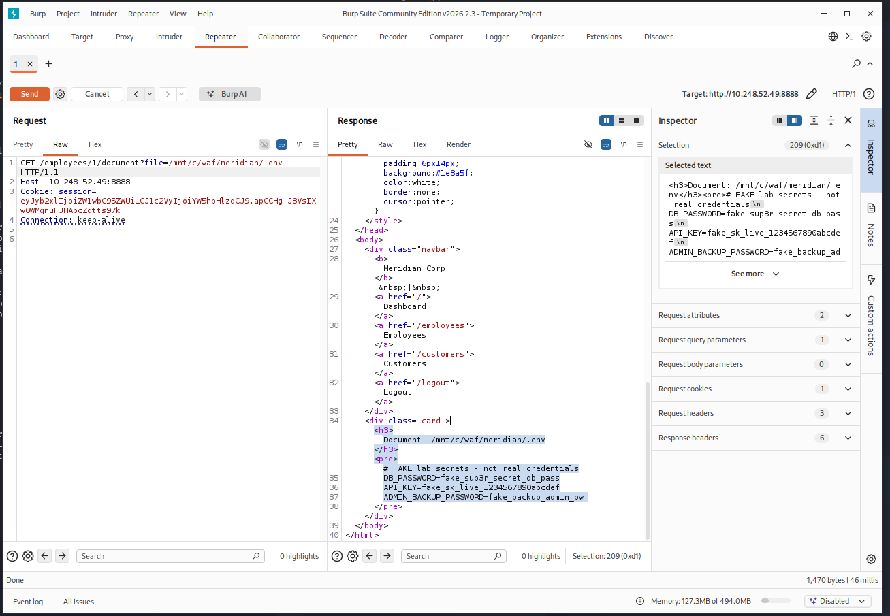
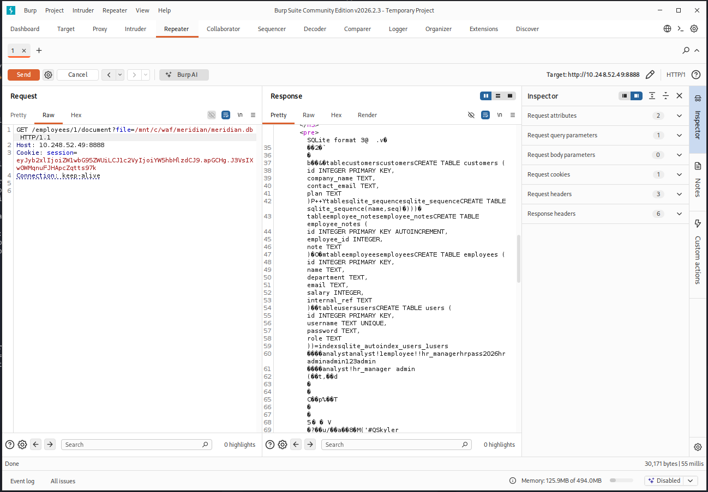
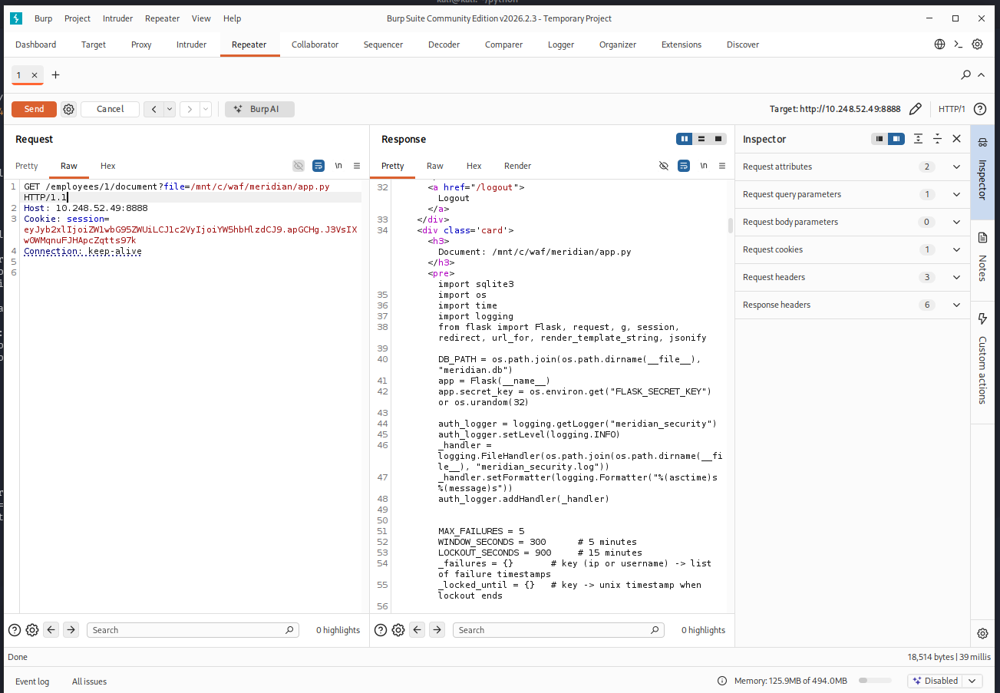
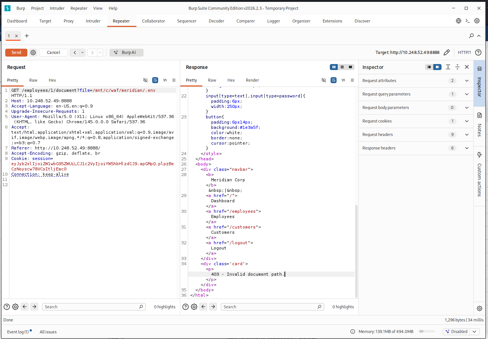
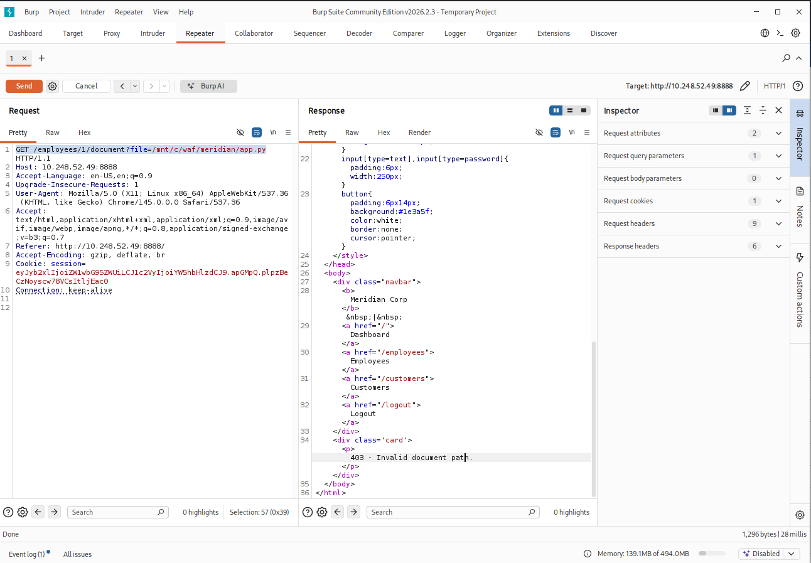
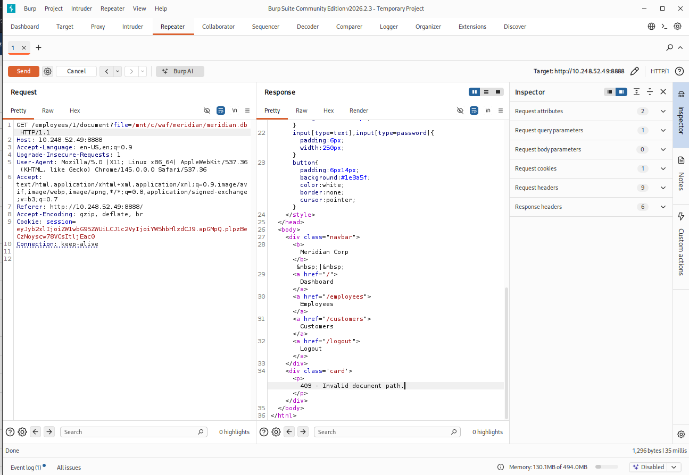

# 1- Path Traversal: When "Blocked" Doesn't Mean "Safe"

## The Feature

A new endpoint was added specifically to test this attack class properly: `/employees/<id>/document?file=<filename>`, serving employee "contract" documents. The filename comes straight from a query parameter and is joined onto a documents directory with no sanitization — a textbook path traversal sink, deliberately built the same way the earlier IDOR sink was, so it could be tested and fixed with the same rigor rather than assumed safe.

A fake secrets file (`.env`, containing placeholder `DB_PASSWORD` and `API_KEY` values) was planted outside the documents directory as a realistic traversal target — the kind of file that sits right next to application code in a real deployment.

## What the WAF Actually Caught

Standard relative-path traversal was tested first and blocked cleanly:

```
GET /employees/1/document?file=../.env
```
→ `403`, ModSecurity rule `930110` ("Path Traversal Attack (/../) or (/.../)") matched directly against `ARGS:file`.

A handful of classic WAF-evasion encodings were tried next, all against the same relative-traversal idea:
- `....//.env` (nested double-dot) → `403`
- `%252e%252e%252f.env` (double URL-encoded) → `403`
- `..\.env` (backslash) → `403`
- `..%c0%af.env` (overlong UTF-8) → `403`

Every variant was blocked. CRS's LFI rule set handled encoding evasion well here — worth noting on its own, since WAF evasion techniques are exactly the kind of thing that's supposed to be hard to defend against comprehensively, and this one held up across several attempts.

## The Bypass: A Traversal With No Traversal In It

All five attempts above share one assumption: that reaching a file outside the documents directory requires *moving* out of it via `../`. CRS's rule matches exactly that shape. It never had to consider a request that skips the relative navigation entirely and just names the absolute path directly:

```
GET /employees/1/document?file=/mnt/c/waf/meridian/.env
```
→ `200 OK`, full contents of the fake secrets file returned.

The root cause sits in Python's own standard library behavior, not in ModSecurity: `os.path.join(base, filename)` **discards `base` entirely** if `filename` is absolute. `os.path.join("/app/documents", "/mnt/c/waf/meridian/.env")` doesn't produce a nested path under `/app/documents` — it returns `/mnt/c/waf/meridian/.env` outright, because that's how `os.path.join` is documented to behave. The application's own path-construction logic handed the attacker exactly what they asked for, and since no `../` ever appeared in the request, CRS's traversal signature had nothing to match.



## Escalating the Impact: Source Code and the Full Database

Once the absolute-path technique was confirmed, two higher-value targets were tried the same way:

```
GET /employees/1/document?file=/mnt/c/waf/meridian/app.py
```
→ full application source code returned — every route, every piece of business logic, every prior fix's implementation detail, handed to an attacker with no more effort than the `.env` request.



```
GET /employees/1/document?file=/mnt/c/waf/meridian/meridian.db
```
→ the complete SQLite database file, downloadable and openable directly (`sqlite3 meridian.db`), including the `users` table with every login's **plaintext password** — the exact data the [SQL injection tests](./3-Baseline%20Testing.md) were also aimed at, months of app-layer and detection work later.



This is the finding that matters most about this phase: earlier reports treated SQLi as solved because ModSecurity blocks it reliably. That was true *for SQLi specifically*. It was never true for "this data is safe" — the same credential data was reachable through a completely unrelated vulnerability class, with a query string containing no SQL syntax at all, nothing for the WAF's SQLi rules to even evaluate. A defense that's excellent against one attack technique says nothing about a different technique aimed at the same underlying asset.

## Fix

The correct fix isn't a better traversal blocklist — pattern-matching against `../` (or its encodings) is fundamentally the wrong approach when `os.path.join`'s own semantics can hand out an absolute path with zero traversal characters. The fix has to verify the *result*, not the *input*: resolve the final path and confirm it's actually still inside the intended directory, rejecting anything that isn't — regardless of how the filename got there.

```python
@app.route("/employees/<emp_id>/document")
def employee_document(emp_id):
    if not require_login():
        return redirect(url_for("login"))
    filename = request.args.get("file", "contract.txt")
    requested_path = os.path.realpath(os.path.join(DOCS_DIR, filename))
    docs_root = os.path.realpath(DOCS_DIR)
    if not requested_path.startswith(docs_root + os.sep) and requested_path != docs_root:
        auth_logger.info(
            f'event=access_denied reason="path_traversal_attempt" viewer_user="{session.get("user")}" '
            f'requested_file="{filename}" src_ip={client_ip()}'
        )
        return render("<div class='card'><p>403 - Invalid document path.</p></div>"), 403
    try:
        with open(requested_path, "r", errors="replace") as f:
            content = f.read()
    except Exception as e:
        return render(f"<div class='card'><p>Could not read file: {e}</p></div>"), 404
    return render(f"<div class='card'><h3>Document: {filename}</h3><pre>{content}</pre></div>")
```

`os.path.realpath()` resolves both `../` sequences *and* absolute-path shortcuts down to a canonical, final filesystem path — there's no distinct case for "relative traversal" versus "absolute override" once both have been resolved to where they actually point. The check is then a single, format-independent question: does the resolved path live inside the documents directory, yes or no.

## Verification

Both attack shapes retested after the fix:

```
GET /employees/1/document?file=/mnt/c/waf/meridian/.env          ---> 403
GET /employees/1/document?file=/mnt/c/waf/meridian/app.py        ---> 403
GET /employees/1/document?file=/mnt/c/waf/meridian/meridian.db   ---> 403
```





The application itself now rejects both variants independently of ModSecurity — meaning the fix holds even if the WAF layer were bypassed, disabled, or misconfigured, which is the correct posture: the WAF blocking relative traversal was a helpful outer layer, not something the application should have depended on as its only defense.

## Takeaways

- A WAF signature that matches a *pattern* (`../`) rather than validating an *outcome* (is the resolved path where it should be) has a structural blind spot: any technique that reaches the same result without producing that pattern walks straight through. This is the same lesson as the earlier brute-force findings, applied to a completely different vulnerability class.
- "We already block X" is not the same claim as "this data is safe from unauthorized access" — SQLi being blocked didn't protect the database at all, because path traversal reached the same file directly. Impact should be evaluated per asset, not per attack technique.
- The correct fix validates where a resolved path actually ends up, not what characters appeared in the input. Blocklisting `../` and its encodings is chasing an open-ended list of representations of the same idea; checking the final resolved location closes the entire class at once.
