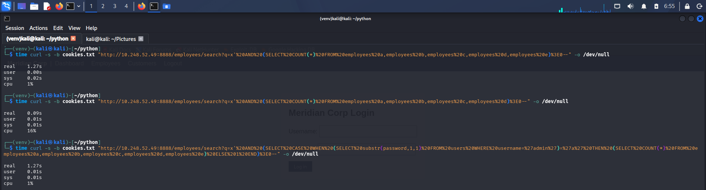
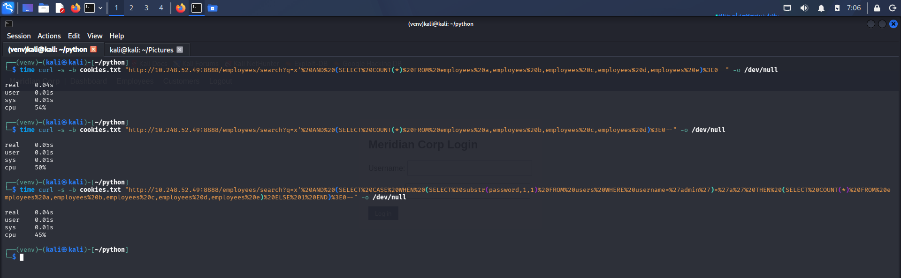
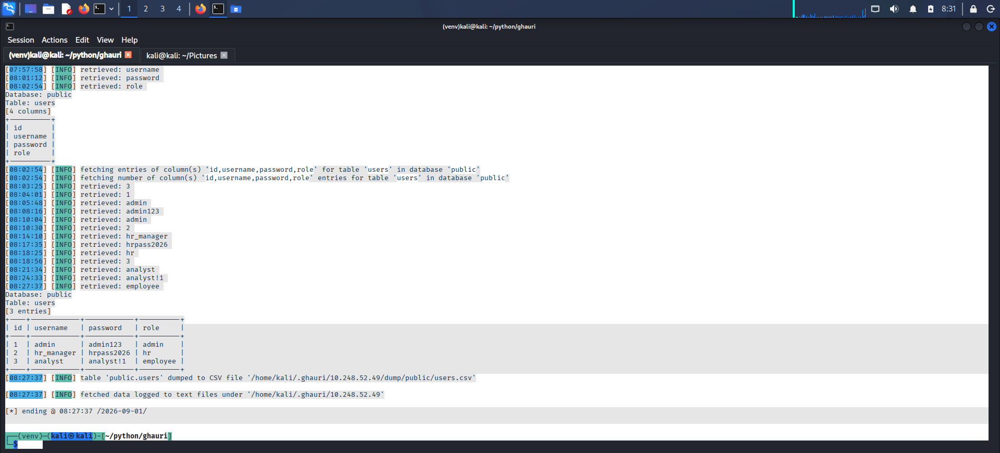
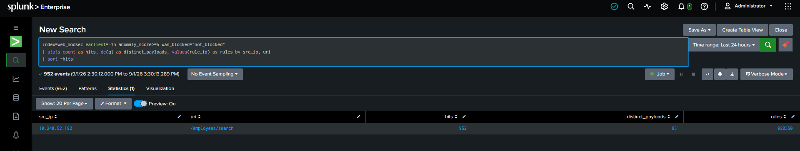
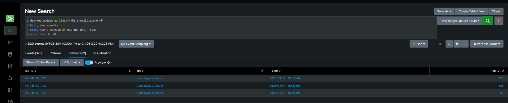

# SQL Injection, Part 6: Time-Based Blind — When Even the Response Looks Identical

## Why This Is the "Blindest" Technique Yet

Boolean-based blind (the [previous phase](./9-Boolean-Based%20Sqli.md)) still leaves a visible trace: the results table is empty or populated, a difference an attacker can observe directly in the page. Time-based blind removes even that. The response can be made to look exactly the same regardless of whether the injected condition is true or false — the only signal is how long the server took to answer. This is the technique of last resort for an attacker facing an application that reveals nothing on the page at all, and it's worth testing because "the page shows nothing unusual" is not the same claim as "nothing can be extracted."

As with error-based and boolean-based testing, this required temporarily reverting the parameterized-query fix, since a fixed query has no SQL condition left to inject.

## SQLite Has No SLEEP() — Building a Delay From Scratch

Time-based SQLi is usually demonstrated with `SLEEP(5)` (MySQL) or `pg_sleep(5)` (PostgreSQL) — direct, purpose-built delay functions. SQLite has neither. An initial attempt using MySQL syntax (`SLEEP()`, `NOW()`, `sysdate()`) predictably did nothing, since SQLite simply doesn't recognize those functions — a reminder that time-based technique syntax is highly database-specific, unlike the underlying vulnerability class.

The working substitute: force SQLite to do enough real computational work that the delay is measurable. A CROSS JOIN of the `employees` table against itself scales combinatorially — with 40 rows per table, joining N copies produces 40^N result rows to evaluate:

```sql
SELECT COUNT(*) FROM employees a, employees b, employees c, employees d, employees e
```

Five copies (40^5 ≈ 102 million row-evaluations) measured at **1.27s**. Four copies (40^4 ≈ 2.56 million) measured at **0.09s** — over a 10x difference from adding a single additional join, confirming the delay scales as expected and is large enough to be a reliable, unambiguous timing signal (not noise from normal request variance).

## Extracting a Real Character via Timing Alone

Same target as the boolean-based phase — the first character of `admin`'s password — but this time the only observable difference is elapsed time, using a `CASE WHEN` to route execution down the expensive or cheap path depending on the guess:

```sql
x' AND (SELECT CASE WHEN
    (SELECT substr(password,1,1) FROM users WHERE username='admin')='a'
    THEN (SELECT COUNT(*) FROM employees a,employees b,employees c,employees d,employees e)
    ELSE 1
END)>0--
```

**Guess `'a'` (correct):** `1.27s` — the expensive branch executed, confirming the condition was true.
**Guess `'z'` (incorrect):** `0.05s` — the cheap branch executed, confirming false.

A ~25x timing difference, with no visible difference in the response content or length at all — both requests return the same shape of page. The only distinguishing signal available to an attacker here is a stopwatch. Repeated across positions and character guesses, this recovers the password exactly as boolean-based did, just through a different oracle.



## Why "the Page Looks the Same" Isn't Reassurance

This is the practical implication worth stating plainly: an application can show absolutely nothing wrong — no reflected errors, no visibly different result sets, nothing a manual review of the rendered page would catch — and still be fully exploitable. Time-based extraction is slower per bit of information than the other techniques tested in this lab, but "slower" doesn't mean "impractical" once it's scripted; it means an automated attack takes longer to run unattended, not that it fails.

## WAF Verification

With `SecRuleEngine` restored to `On` (code still in its vulnerable state for this test), the identical timing payloads were replayed:

```
5-way cross join (heavy):  0.04s
4-way cross join (light):  0.05s
CASE WHEN 'a' (heavy branch expected): 0.04s
```



All three near-identical and fast — the timing differential that defined this entire technique disappeared completely. This isn't the WAF making the query run faster; it's the WAF rejecting the request with a `403` before it ever reaches SQLite, so the expensive query never executes at all. The same quote-break-plus-SQL-grammar shape that caught UNION-based, error-based, and boolean-based payloads catches this one too — no dedicated time-based rule was needed, consistent with every other SQLi variant tested in this lab.

## Fix

No new fix. This is the same root cause as the rest of the SQLi family — the vulnerable line was reverted only for the duration of this test and needs to be (and was) reapplied immediately after. The [parameterized query](./7-Union-Based%20Sqli.md) removes the ability to inject a `CASE WHEN` condition at all, the same way it removed `UNION`, raw errors, and boolean conditions — there's no per-technique patching required because the fix operates on query construction itself, not on any specific attack shape.

## Takeaways

- Time-based blind SQLi requires no visible difference in application behavior at all — an attacker with nothing to look at except response timing can still exfiltrate data character by character. "The page never shows anything unusual" is not evidence of safety.
- Technique syntax is highly database-specific (no `SLEEP()` in SQLite), but the underlying vulnerability and its fix are not — the same parameterization closes every technique variant regardless of which database engine is behind it.
- The WAF's blocking is not technique-aware here either: it stops the request before any SQL executes, so it doesn't matter to ModSecurity whether the payload was designed to dump data, trigger an error, or measure time — the same grammar-detection layer covers all of them.

---

# SQL Injection, Part 7: Migrating to PostgreSQL and Letting a Real Tool Do the Work

## Why Migrate Off SQLite

Every SQLi technique tested so far (UNION-based, error-based, boolean-blind, time-blind) had been demonstrated manually — one crafted `curl`/Burp request at a time, with SQLite-specific syntax substituted in wherever a technique's usual form didn't apply (no `SLEEP()`, no `@@version`, a CROSS JOIN standing in for a proper delay function). That's useful for understanding the mechanism, but it isn't how a real attacker works. Real SQLi exploitation is almost always automated — `sqlmap`, `ghauri`, and similar tools handle detection, DBMS fingerprinting, and full data extraction with a single command.

Testing that automation against this lab's app surfaced a gap worth being honest about: `ghauri` (and, by its own tooling conventions, most mainstream SQLi automation) has minimal-to-no SQLite support — every automated run defaulted to testing MySQL, MSSQL, PostgreSQL, and Oracle payloads, with SQLite never appearing in the tested technique list regardless of an explicit `--dbms sqlite` flag. Rather than treat "the popular tools don't target this DB" as a false sense of security (the app was already proven fully exploitable by hand, on SQLite, across four technique classes), the backend was migrated to PostgreSQL — a database engine every mainstream SQLi tool supports properly, and a genuinely more realistic choice for this kind of application in the first place.

## What the Migration Involved

- `sqlite3` → `psycopg2`, with the connection helper rewritten around a `RealDictCursor` so the rest of the codebase's `row['field']` access pattern needed no further changes.
- Parameter placeholders: SQLite's `?` → PostgreSQL's `%s`.
- Schema: `INTEGER PRIMARY KEY AUTOINCREMENT` → `SERIAL PRIMARY KEY`.
- A PostgreSQL-specific behavior worth flagging for anyone doing this migration: after a query raises an error, PostgreSQL leaves the connection in an aborted-transaction state — every subsequent query on that connection fails until an explicit `ROLLBACK`. SQLite has no equivalent restriction. `employees_search()`'s error handler needed `db.rollback()` added specifically to avoid this, or the app would silently break after the very first triggered SQL error.
- The vulnerable line in `employees_search()` was deliberately reset to its unparameterized, string-formatted form for this phase — the fix pattern is already proven; the point here is re-establishing the vulnerability against a database real tooling can actually attack, not re-inventing the fix.

## What Ghauri Actually Demonstrates: Privilege Escalation, Not a Break-In

Worth being precise about what this run does and doesn't prove. The `--cookie` flag handed ghauri an already-valid, already-authenticated session for `analyst` — the lowest-privilege account in this app (`role: employee`). Ghauri never broke authentication; it was never asked to. What it demonstrates is what that low-privilege session could reach through the SQLi endpoint alone: a user with no legitimate access to anyone else's data extracted the `admin` account's own plaintext password.

That reframing matters. This isn't "an attacker with nothing broke in" — it's "an attacker who already has *any* valid low-privilege foothold (a phished employee credential, a weak or reused password, a leaked session) can escalate straight to full admin compromise via a single vulnerable endpoint that never checks role at all." This is the more realistic and more common real-world shape of the attack — MITRE ATT&CK's Privilege Escalation category exists precisely because "get some access, then escalate" is how most real intrusions actually progress, far more often than a clean unauthenticated compromise.

## Automated Exploitation With Ghauri

```bash
ghauri -u "http://<target>:8888/employees/search?q=test" \
  --cookie "session=<analyst session cookie>" \
  --dbms postgres --technique T --batch --level 3 --time-sec 5 -p q
```

Detection took under 15 seconds and correctly fingerprinted both the injection point and the DBMS:

```
Parameter: q (GET)
    Type: time-based blind
    Payload: q=test' AND 4564=(SELECT 4564 FROM PG_SLEEP(9))--
[...] the back-end DBMS is PostgreSQL
```

Worth noting directly: `ghauri` reached for PostgreSQL's native `PG_SLEEP()` — the exact primitive this lab had to manually work around on SQLite with a CROSS JOIN delay trick. Real DBMS-specific delay functions make time-based extraction dramatically less effort to build than the manual version tested in the [previous phase](./18-sqli-time-based-blind.md); the technique isn't different, but the tooling built for a database with real time-delay support removes essentially all of the manual craftsmanship this lab needed for SQLite.

A full table dump followed with one additional flag:

```bash
ghauri [...] --dump -D public -T users
```

Result — every row of the `users` table, fully automated, no manual character guessing:

```
+----+------------+------------+----------+
| id | username   | password   | role     |
+----+------------+------------+----------+
| 1  | admin      | admin123   | admin    |
| 2  | hr_manager | hrpass2026 | hr       |
| 3  | analyst    | analyst!1  | employee |
+----+------------+------------+----------+
```



This took roughly 34 minutes end-to-end (time-based extraction is inherently slow — every character requires waiting out a real delay) and required 1,056 individual HTTP requests, all issued automatically. The result is identical in substance to the credentials manually extracted via boolean-based blind in an earlier phase — the value of automation here isn't a different outcome, it's the same outcome with zero manual craftsmanship and zero attacker attention required once the command is launched.

## Confirming the WAF Stops the Tool Too

Every prior WAF check in this SQLi track had been against manual, hand-crafted payloads. Whether ModSecurity's rules generalize to an automated tool's payload generation — which cycles through dozens of DBMS-specific technique variants far faster and more systematically than a human would — was still an open question. With `SecRuleEngine` restored to `On`, the exact same ghauri command was rerun (fresh session, fresh login cookie, `--flush-session` to avoid reusing cached results from the earlier `DetectionOnly` run):

```
[INFO] testing 'PostgreSQL > 8.1 AND time-based blind (comment)'
[...]
[WARNING] GET parameter 'q' does not seem to be injectable
[CRITICAL] all tested parameters do not appear to be injectable.
```

Ghauri found nothing — every technique variant it tried, across every DBMS family it probes by default, was rejected by the same rule set that caught the manual payloads throughout this SQLi track. The tool doesn't get special treatment from the WAF for being automated, and it doesn't get past it either: the underlying request shape (quote-break followed by valid SQL grammar) is what CRS matches on, and that shape doesn't change just because a tool generated it instead of a person.

## Detecting the Tool, Not Just the Technique

Every one of those 1,056 requests matched the same SQLi rules already covered in this lab (`920350`, the anomaly-score threshold, etc.) — no new WAF signature is needed to catch ghauri's payloads individually. But that's the wrong question. A single one of these requests looks exactly like any other manual SQLi probe tested throughout this lab. What's different — and what's actually detectable as *automation specifically* — is volume and payload diversity from one source in a short window:

```
index=web_modsec earliest=-1h anomaly_score>=5 was_blocked="not_blocked"
| stats count as hits, dc(q) as distinct_payloads, values(rule_id) as rules by src_ip, uri
| sort -hits
```

```
src_ip           uri                  hits   distinct_payloads   rules
10.248.52.192    /employees/search    952    931                 920350
```


No human tester in this lab ever sent more than a handful of requests per finding. 1,056 requests with 906 distinct payloads against one endpoint from one source is not something a manual tester produces — it's a tool's output. Binning by a 5-minute window makes the automation even more visually obvious:

```
index=web_modsec earliest=-1h anomaly_score>=5 was_blocked="not_blocked"
| bin _time span=5m
| stats count as hits by src_ip, uri, _time
| where hits >= 20
```

```
_time                  hits
2026-09-01 15:15:00    125
2026-09-01 15:20:00    126
2026-09-01 15:25:00    58
```



A near-constant ~125 requests every 5 minutes, tapering off exactly when the tool's run completed — machine-paced, not human-paced. This is the meta-detection pattern from an [earlier phase](./9-Boolean-Based%20Sqli.md) (matched-but-not-enforced traffic, useful for catching a WAF silently left in `DetectionOnly`) repurposed for a second, distinct job: the same underlying data also answers "is something automated hammering this endpoint," a question about attacker behavior rather than WAF health, using the same fields with no new instrumentation required.

## Takeaways

- This was privilege escalation from an already-authenticated low-privilege session, not an unauthenticated break-in — a distinction worth stating precisely, since it's the more common and arguably more dangerous real-world shape of this vulnerability class (any foothold + one unchecked endpoint = full compromise).
- Popular SQLi tooling's database coverage isn't universal — SQLite support in `ghauri` was effectively absent, which could easily read as "this backend is safer against automated attack" if taken at face value. It isn't; it was already proven fully exploitable by hand. Migrating to a database mainstream tools support properly was the honest way to test that assumption rather than quietly benefit from it.
- Automation doesn't change what's extractable, it changes the cost of extracting it — the same three credentials recovered manually via boolean-based blind came out identically via `ghauri`, just without an attacker needing to script or think about it themselves.
- The WAF's protection generalizes to tool-generated payloads, not just hand-crafted ones — confirmed directly by rerunning the exact same automated attack with blocking enabled and getting a clean "not injectable" result, the same outcome a manual attacker gets against this configuration.
- A WAF rule doesn't need to be technique-aware to have detectable automation running past it (in the DetectionOnly window it did operate in). Volume and payload diversity from a single source, over a tight window, is a signature of tooling regardless of which specific SQLi technique is being attempted — and it's visible in data this lab was already collecting for an unrelated purpose.
