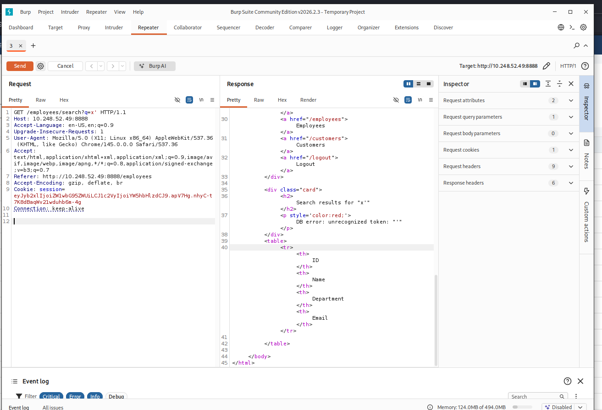
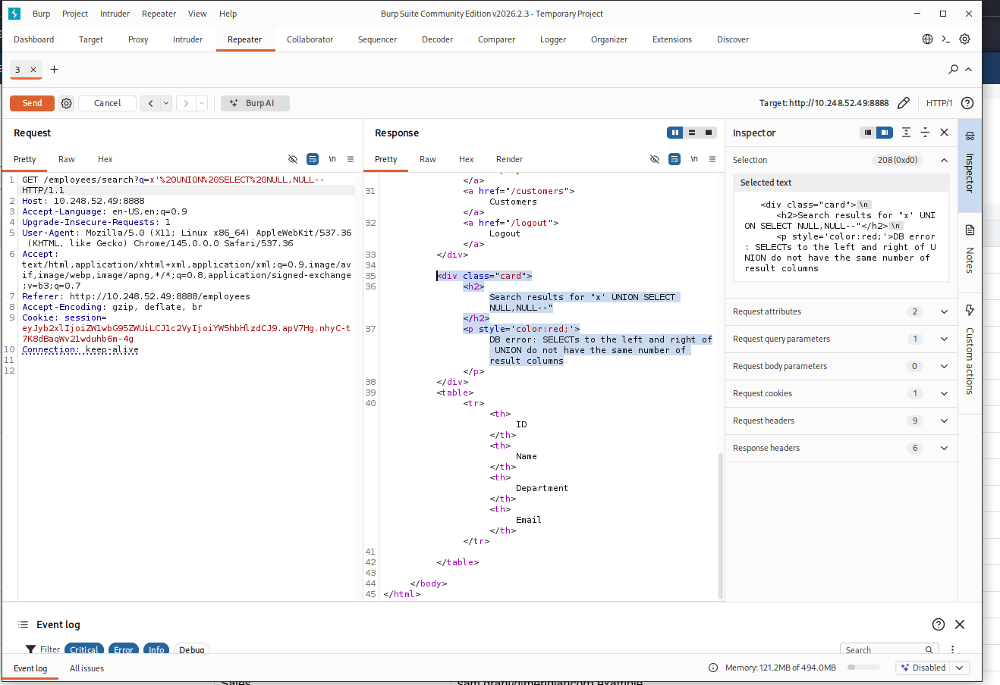

# SQL Injection, Error-Based — What the WAF Was Actually Protecting

## Why This Phase Is Different From the Others

By the time this phase started, the UNION-based SQL injection had already been fixed at the code level (parameterized query), not just blocked at the WAF. That created an interesting problem for testing error-based SQLi specifically: with the fix in place, `/employees/search?q=x'` no longer produces a SQL error at all — the quote is treated as a literal character to search for, so there's nothing for an error-based technique to trigger. The vulnerability wasn't just blocked; it stopped existing.

To actually see what error-based SQLi would have exposed, the fix had to be temporarily reverted — reintroducing the exact vulnerable line (`f"...WHERE name LIKE '%{q}%'"` instead of the parameterized version) purely to observe what information leaks through this application's own error handling, then reapplying the fix immediately afterward. This is the same "prove it's real" discipline used for the UNION-based phase, just applied to the code layer instead of the WAF layer — a fix isn't meaningfully verified as complete until you've actually seen the failure mode it prevents.

## What the App Was Doing

`employees_search()` catches `sqlite3.Error` and reflects the exception text directly into the page:

```python
except sqlite3.Error as e:
    rows = []
    error = str(e)
...
{"<p style='color:red;'>DB error: " + error + "</p>" if error else ""}
```

This is a separate weakness from the injection itself — reflecting raw database exceptions to the end user (CWE-209, information exposure through an error message) — and it's what makes error-based SQLi meaningfully more than "yet another way to trigger a 403."

## What Leaked

**A bare syntax break** (`q=x'`) produced:
```
DB error: unrecognized token: "'"
```
Low information value on its own — SQLite's tokenizer error here doesn't name a table, column, or query structure.



**A UNION with a deliberately wrong column count** (`q=x' UNION SELECT NULL,NULL--`, guessing 2 when the real query returns 4) produced:
```
DB error: SELECTs to the left and right of UNION do not have the same number of result columns
```




This is the actually damaging one. It's not just an error — it's a direct, unambiguous **oracle**: it tells an attacker their guess was wrong in a way that's trivially exploitable. Without this feedback, discovering the column count blind requires trial and error with no signal of progress. With it, an attacker just increments the count (`NULL,NULL` → `NULL,NULL,NULL` → `NULL,NULL,NULL,NULL`) until the specific "column count mismatch" message disappears — at which point they know, with certainty, the exact number of columns the query returns. This is Step 1 of the UNION-based methodology from [an earlier phase](./7-Union-Based%20Sqli.md), except instead of inferring it through blocked/unblocked responses, the database is stating it outright.

## Why the WAF Being There Mattered More Than It Looked

Every error-based payload tested — the bare quote, the deliberately-wrong-column UNION, the earlier `AND 1/0` and missing-argument function calls — was blocked by ModSecurity when it was active (`403`, same rule set as the UNION-based findings: quote-break followed by valid SQL grammar). At the time, that looked like redundant confirmation of something already proven. Seeing the actual error output changes that assessment: the WAF wasn't just preventing data exfiltration via UNION, it was preventing an attacker from getting a **structured discovery process handed to them for free** by this application's own error messages. The value of blocking error-based attempts specifically is less about the single request and more about denying the attacker a feedback loop.

## The Fix Was Already Complete — This Just Confirms It

No new fix came out of this phase. The parameterized query from the previous phase already closes this: with `q` bound as a parameter rather than interpolated into the query string, there's no way to break out of the string context in the first place, so no SQL error can be triggered by user input at all — error-based, UNION-based, and blind all die at the same root cause. This phase exists to confirm that claim rather than assume it, by deliberately reverting to the vulnerable version, observing the leak, and reapplying the fix.

No new Splunk detection was built for this phase either, and that's a deliberate call, not an oversight: every error-based payload tested shares the same "quote-break + valid SQL grammar" shape that the existing SQLi detection (942100/942270, etc.) already catches — a dedicated "error-based" detection would just be re-alerting on the same signal the UNION-based detection already covers.

## Takeaways

- A fix can be so complete that it removes the ability to even observe the vulnerability it closed — which is a good sign, but it means "prove it's real" sometimes requires deliberately reverting a fix in a scoped, temporary way rather than testing against the current (already-safe) code.
- Reflecting raw database error messages to users is a distinct weakness from the injection itself, and it's what turns "the WAF blocks payloads" into "the WAF was preventing free reconnaissance." A column-count mismatch error isn't dangerous because of what it contains — it's dangerous because of what it confirms.
- Not every finding needs its own detection. Recognizing that error-based SQLi shares an attack shape already covered by an existing detection avoided building a redundant, noisier duplicate of the same alert.
