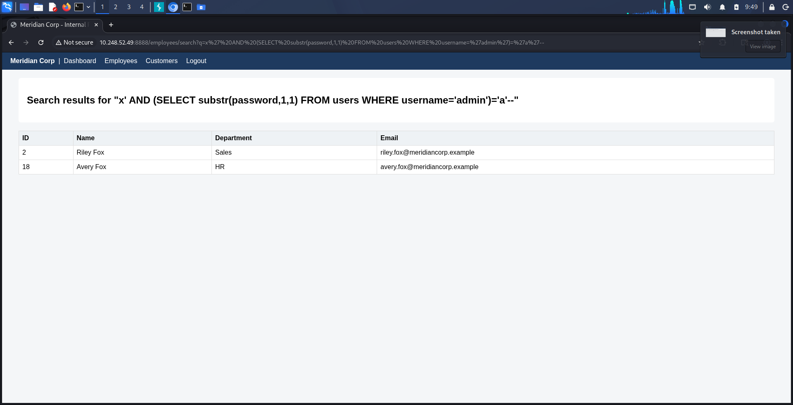
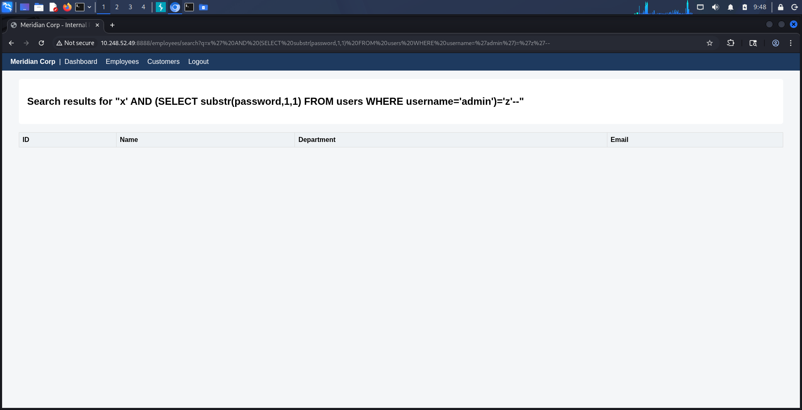
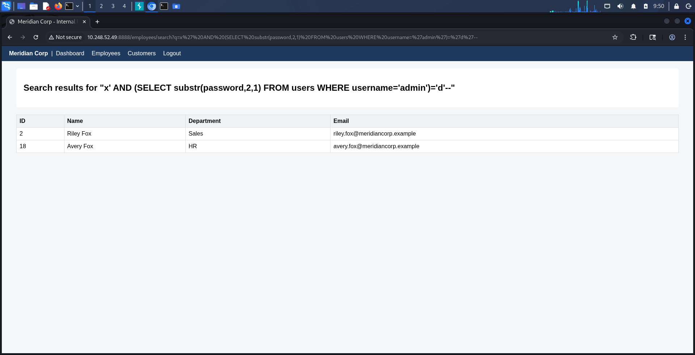
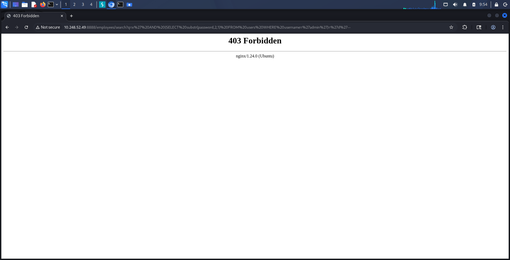
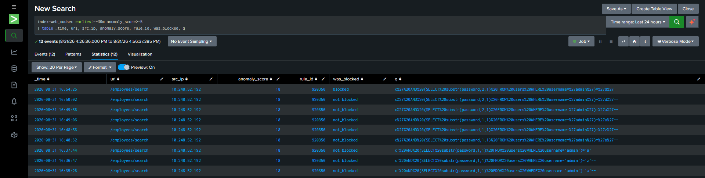

# SQL Injection, Part 5: Boolean-Based Blind — Extracting Data Without Ever Seeing It

## Why "Blind" SQLi Is a Different Threat Than It Sounds

Every SQLi technique tested in earlier phases relied on the application putting attacker-chosen data directly on the page — UNION-based dumped rows into the results table, error-based reflected raw database exceptions. Both leave an obvious trail: the response visibly contains data it shouldn't. Boolean-based blind SQLi doesn't. The response never contains the secret at all — only a yes/no signal about whether a guess was correct. That makes it slower to exploit but just as dangerous, and importantly, harder to notice is even happening, since nothing "wrong-looking" ever appears in the output.

As with the [error-based phase](./8-Error-Based%20Sqli.md), testing this required temporarily reverting the parameterized-query fix — with the fix applied, `q` is never interpreted as SQL at all, so there's no boolean condition to inject in the first place.

## The Mechanism

The vulnerable query is:
```sql
SELECT id, name, department, email FROM employees WHERE name LIKE '%{q}%'
```

Injecting `x' AND (condition)='a'--` turns this into:
```sql
WHERE name LIKE '%x' AND (condition)='a'--%'
```

When `(condition)='a'` evaluates true, the `AND` clause doesn't filter anything out — the query behaves close to its normal, unrestricted self, and the results table gets populated. When it evaluates false, the whole `WHERE` clause becomes false, and the table returns empty. The application never displays the value being tested — only whether the guess matched, visible purely as "did any rows come back."

## Extracting a Real Password, One Character at a Time

The target: the first two characters of the `admin` account's password, using
```sql
substr(password, N, 1) = '<guess>'
```
to test position `N` against a guessed character.

**Position 1, guess `'a'`:**
```
q=x' AND (SELECT substr(password,1,1) FROM users WHERE username='admin')='a'--
```
Result: `200`, table populated with 2 rows (an incidental side effect of the injected `AND 1` coercion also matching names containing "x" — not attacker-relevant, since a real attacker only checks whether the table is empty or not, typically via response length). This is a **true** result, correctly matching the known password `admin123`.



**Position 1, guess `'z'`:**
```
q=x' AND (SELECT substr(password,1,1) FROM users WHERE username='admin')='z'--
```
Result: `200`, empty table — **false**, correctly rejecting the wrong letter.




**Position 2, guess `'d'`:**
```
q=x' AND (SELECT substr(password,2,1) FROM users WHERE username='admin')='d'--
```
Result: `200`, populated table — **true**, correctly matching the second character of `admin123`.



The pattern generalizes directly: increment the position index for each character, and for each position, try letters/digits until the response goes from empty to populated (or compare response `Content-Length`, which is what a real automated attack would script rather than eyeballing HTML). Repeated across all 8 characters of the password, this fully recovers `admin123` — or any other account's password, or any other column in the database — without the value ever appearing in a response body.

## Why This Matters as a Distinct Finding From UNION-Based

UNION-based SQLi requires the query to actually be capable of returning attacker-chosen rows in a format the page renders — it fails if the page doesn't display raw query output anywhere useful. Boolean-based blind has no such requirement: it only needs *any* observable difference between a true and a false condition — page content, response length, an HTTP status code, a redirect target, anything. This makes it a strictly harder technique to eliminate through output-shaping alone (e.g. "don't reflect query results directly") — the vulnerability lives entirely in the query construction, not in what the page happens to display.

## Fix

No new fix — this is the same root cause as every other SQLi variant in this lab, and the same [parameterized-query fix](./7-Union-Based%20Sqli.md) closes it completely: with `q` passed as a bound parameter rather than interpolated into the query string, there is no `AND (condition)='x'` to inject in the first place, true or false. The vulnerable line was reverted only for the duration of this test and immediately restored afterward.

No new WAF-bypass angle either — every payload here shares the same quote-break-plus-`AND` shape already caught by the SQLi rules tested in the [UNION-based phase](./7-Union-Based%20Sqli.md).

## Confirming the WAF and Splunk Side, Not Just the Code Fix

The vulnerable query was reverted only for the duration of the test above and reapplied immediately afterward — but before moving on, two more things needed checking, because the boolean-based technique had only ever been tested against a *disabled* WAF (`DetectionOnly`). Whether ModSecurity's SQLi rules generalize to this specific payload shape, and whether the meta-detection built in an earlier phase would correctly track the transition from "unenforced" to "enforced," were both still open questions.

With the code fix reapplied and `SecRuleEngine` restored to `On`, the exact position-2 boolean payload was replayed:

```
GET /employees/search?q=x'%20AND%20(SELECT%20substr(password,2,1)%20FROM%20users%20WHERE%20username='admin')='d'--
```

Result: `403 Forbidden`. No dedicated boolean-SQLi rule was needed — the same quote-break-plus-`AND`-grammar shape that CRS's rule set (942100/942270, from the [UNION-based phase](./7-Union-Based%20Sqli.md)) already catches covers this technique too, without any additional configuration.




The `web_modsec` meta-detection built in the [previous SQLi phase](./8-Error-Based%20Sqli.md) — the `was_blocked` field derived from whether "Access denied" appears in the audit log entry — was then checked against the full test session:

```
index=web_modsec earliest=-30m "substr(password"
| table _time, uri, src_ip, anomaly_score, rule_id, was_blocked, q
```

| Time | Payload (abbreviated) | was_blocked |
|---|---|---|
| 16:35–16:54 (8 requests, DetectionOnly) | `substr(password,1,1)='a'`, `='z'`, `substr(password,2,1)='a'`, `='d'` | not_blocked |
| 16:54:25 (SecRuleEngine On) | `substr(password,2,1)='d'` | **blocked** |




The transition is captured cleanly and automatically — no manual correlation needed, no separate log to check. This confirms the field-extraction work from the meta-detection phase generalizes beyond the single technique it was built to catch (a UNION-based DetectionOnly bypass): it correctly classifies enforcement state for an entirely different SQLi variant tested in a completely separate session, which is exactly what a search-time field extraction keyed on the log's own content (rather than on any specific payload) should do.

## Takeaways

- Blind SQLi doesn't require the application to leak data visibly — it only needs one bit of observable difference between true and false. That's a much lower bar than UNION-based injection needs, which is why "the page doesn't obviously show query results" is not a meaningful mitigation on its own.
- A single boolean oracle (true/false via response content, length, or status) is sufficient to extract arbitrary data character-by-character, given enough requests. Slow doesn't mean safe — it means automatable.
- This phase again confirms the parameterization fix generalizes across the entire SQLi technique family, rather than needing a per-technique patch — the same fix already verified for UNION-based and error-based closes boolean-based blind for the identical reason.
